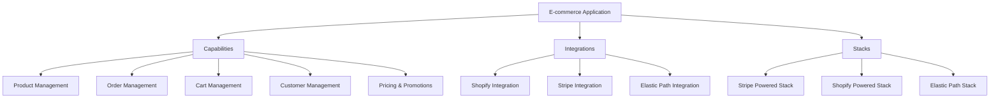

# Reference E-commerce Account

Welcome to the Reference E-commerce Account documentation. This account serves as a comprehensive example of an e-commerce system, showcasing various capabilities, integrations, and applications that can be used to build a robust online retail platform.

## Overview

This account demonstrates the implementation of a full-featured e-commerce solution, including:

- Product management
- Order processing
- Cart functionality
- Customer management
- Pricing and promotions
- Inventory management
- Search and discovery
- Tax calculation
- Loyalty programs

## Structure

The account is organized into several key areas:

1. **Capabilities**: Core functionalities that power the e-commerce system
2. **Providers**: Third-party services and platforms that can be integrated
3. **Integrations**: Connections between capabilities and providers
4. **Stacks**: Pre-configured combinations of capabilities and integrations
5. **Applications**: End-user facing e-commerce applications

## Key Components

### Capabilities

Our reference e-commerce account includes the following capabilities:

- [Product Management](./capability/product-management/README.md)
- [Order Management](./capability/order-management/README.md)
- [Cart Management](./capability/cart-management/README.md)
- [Customer Management](./capability/customer-management/README.md)
- [Pricing Service](./capability/pricing_service/README.md)
- [Promotions](./capability/promotions/README.md)
- [Inventory Service](./capability/inventory_service/README.md)
- [Search Service](./capability/search_service/README.md)
- [Tax Calculation](./capability/tax_calculation/README.md)
- [Loyalty Service](./capability/loyalty_service/README.md)
- [Customer Segmentation](./capability/customer_segmentation/README.md)

Each capability is designed to be modular and can be integrated with various providers or custom implementations.

### Providers

We have included integrations with several popular e-commerce providers:

- [Shopify](./provider/shopify/README.md)
- [Stripe](./provider/stripe/README.md)
- [Elastic Path](./provider/elastic-path/README.md)
- [Commercetools](./provider/commercetools/README.md)
- [VTEX](./provider/vtex/README.md)
- [Salesforce](./provider/salesforce/README.md)
- [Pipe17](./provider/pipe17/README.md)
- [Bluestone PIM](./provider/bluestone-pim/README.md)

These providers offer various services that can be leveraged to build a complete e-commerce solution.

### Integrations

Our reference account includes several pre-built integrations that connect capabilities with specific providers. Some key integrations include:

- [Shopify Product Management](./integration/shopify-product-management/README.md)
- [Stripe Tax Integration](./integration/stripe_tax_integration/README.md)
- [Elastic Path Cart Integration](./integration/elastic-path-cart/README.md)

### Stacks

We have defined several e-commerce stacks that combine different capabilities and integrations:

- [Stripe Powered Stack](./stack/stripe-powered-stack/README.md)
- [Shopify Powered Stack](./stack/shopify-powered/README.md)
- [Elastic Path Stack](./stack/ep-stack/README.md)

These stacks provide ready-to-use configurations for different e-commerce scenarios.

### Applications

The reference account includes a basic e-commerce application that demonstrates how to use the various capabilities and integrations:

- [Basic E-commerce Application](./application/basic-ecommerce/README.md)

This application covers essential features such as product browsing, shopping cart management, checkout process, and account management.

## Getting Started

To start exploring this reference e-commerce account:

1. Review the capabilities to understand the core functionalities available.
2. Explore the providers to see which third-party services can be integrated.
3. Check out the integrations to understand how capabilities and providers can be connected.
4. Look at the pre-configured stacks for inspiration on how to combine different components.
5. Examine the basic e-commerce application to see how everything comes together in a working example.

## Customization and Extension

This reference account is designed to be a starting point. You can customize and extend it by:

- Adding new capabilities specific to your business needs
- Integrating additional providers
- Creating custom integrations between capabilities and providers
- Defining new stacks that align with your architecture preferences
- Building more complex applications on top of the provided capabilities and integrations

## Support and Contributions

For any questions or support regarding this reference e-commerce account, please contact the development team.

We welcome contributions and suggestions to improve this reference implementation. Please follow the standard pull request process to submit your ideas or improvements.

Happy e-commerce building!

This diagram illustrates the high-level architecture of our reference e-commerce account, showing how the application is built on top of capabilities, integrations, and pre-configured stacks.