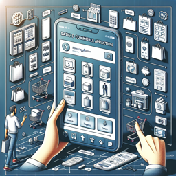

# Basic E-commerce Application
An e-commerce platform allowing users to browse, purchase products and manage their orders

**Application Metadata**
| Property | Value |
|----------|------|
| Application Code | `basic-ecommerce` |
| Application Image |  |

## Application Features

### Product Browsing
Allow users to browse and search products in the catalog

**Feature Metadata**
| Property | Value |
|----------|------|
| Feature Code | `prod-browsing` |

**User Stories**
| Title | Code | Role | Objective | Benefit |
|-----------|------------|----------|---------------|-------------|
| View Product Catalog | `view-products` | Shopper | browse through available products | I can find items I'm interested in purchasing |
| View Product Details | `product-details` | Shopper | view detailed information about a specific product | I can make an informed purchase decision |
| View Product Recommendations | `product-recommendations` | Shopper | see related or recommended products | I can discover additional items I might be interested in |

### Shopping Cart Management
Enable users to manage items in their shopping cart

**Feature Metadata**
| Property | Value |
|----------|------|
| Feature Code | `shopping-cart` |

**User Stories**
| Title | Code | Role | Objective | Benefit |
|-----------|------------|----------|---------------|-------------|
| Add to Cart | `add-to-cart` | Shopper | add items to my shopping cart | I can collect items I want to purchase |
| Modify Cart | `modify-cart` | Shopper | update quantities or remove items from my cart | I can adjust my intended purchase before checkout |

### Checkout Process
Allow users to complete their purchase

**Feature Metadata**
| Property | Value |
|----------|------|
| Feature Code | `checkout` |

**User Stories**
| Title | Code | Role | Objective | Benefit |
|-----------|------------|----------|---------------|-------------|
| Complete Purchase | `complete-purchase` | Shopper | securely complete my purchase | I can buy the items in my cart |
| Provide Shipping Information | `shipping-info` | Shopper | enter my shipping address | I can receive my purchased items |

### Account Management
Enable users to manage their account and view order history

**Feature Metadata**
| Property | Value |
|----------|------|
| Feature Code | `account-mgmt` |

**User Stories**
| Title | Code | Role | Objective | Benefit |
|-----------|------------|----------|---------------|-------------|
| Create Account | `create-account` | Shopper | create a new account | I can manage my orders and shopping history |
| Login to Account | `login` | Registered User | log into my account | I can access my personal information and order history |
| View Order History | `view-orders` | Registered User | view my previous orders | I can track my purchase history |
| Track Order Status | `track-order` | Registered User | check the status of my current orders | I can know when to expect my purchases |
