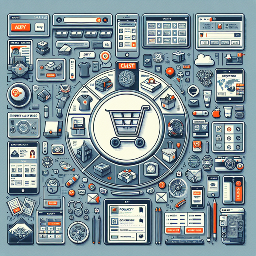

# E-commerce Shopping Application
An online shopping platform that allows users to browse products, manage their cart, and complete purchases

**Application Metadata**
| Property | Value |
|----------|------|
| Application Code | `ecommerce-app` |

## Application Images
| Medium | Small | Square |
|--------|-------|--------|
|  |  |  |

## Application Features

### Product Browsing
Allows users to view and search through available products

**Feature Metadata**
| Property | Value |
|----------|------|
| Feature Code | `product-browsing` |

**User Stories**
| Title | Code | Role | Objective | Benefit |
|-----------|------------|----------|---------------|-------------|
| View Product Catalog | `view-product-list` | shopper | browse through a list of available products | I can find items I'm interested in purchasing |
| View Product Details | `view-product-details` | shopper | view detailed information about a specific product | I can make an informed purchase decision |
| View Product Recommendations | `view-recommendations` | shopper | see related or recommended products | I can discover additional items I might be interested in |

### Shopping Cart Management
Enables users to manage items in their shopping cart

**Feature Metadata**
| Property | Value |
|----------|------|
| Feature Code | `shopping-cart` |

**User Stories**
| Title | Code | Role | Objective | Benefit |
|-----------|------------|----------|---------------|-------------|
| Add to Cart | `add-to-cart` | shopper | add products to my shopping cart | I can collect items I want to purchase |
| Update Cart Quantities | `update-cart-quantity` | shopper | modify the quantity of items in my cart | I can adjust my intended purchase amount |
| Remove from Cart | `remove-from-cart` | shopper | remove items from my shopping cart | I can eliminate items I no longer want to purchase |

### Checkout Process
Allows users to complete their purchase

**Feature Metadata**
| Property | Value |
|----------|------|
| Feature Code | `checkout` |

**User Stories**
| Title | Code | Role | Objective | Benefit |
|-----------|------------|----------|---------------|-------------|
| Enter Shipping Information | `enter-shipping-info` | shopper | enter my shipping address and contact details | I can receive my purchased items |
| Select Payment Method | `select-payment-method` | shopper | choose and enter my payment information | I can pay for my selected items |
| Review Order | `review-order` | shopper | review my order details before confirming | I can verify all information is correct before finalizing my purchase |
