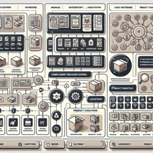

# Inventory Service
Manages inventories, items, product variants, and locations within the system, providing comprehensive inventory control and tracking capabilities.

**Capability Metadata**
| Property | Value |
|----------|------|
| Capability Code | `inventory_service` |
| Capability Image |  |

## Capability Operations

<a name="get_inventory_level"></a>
### Get Inventory Level
Retrieves current inventory level for a specific product variant at a given location

**Operation Metadata**
| Property | Value |
|----------|------|
| Operation Code | `get_inventory_level` |

#### Input Schema
```json Get Inventory Level operation input schema
{
  "type": "object",
  "properties": {
    "variantId": {
      "type": "string"
    },
    "locationId": {
      "type": "string"
    }
  },
  "required": [
    "variantId",
    "locationId"
  ]
}
```

#### Output Schema
```json Get Inventory Level operation output schema
{
  "type": "object",
  "properties": {
    "quantity": {
      "type": "number"
    },
    "availableQuantity": {
      "type": "number"
    },
    "reservedQuantity": {
      "type": "number"
    }
  }
}
```
<a name="adjust_inventory"></a>
### Adjust Inventory
Updates inventory quantity for a specific product variant at a location

**Operation Metadata**
| Property | Value |
|----------|------|
| Operation Code | `adjust_inventory` |

#### Input Schema
```json Adjust Inventory operation input schema
{
  "type": "object",
  "properties": {
    "variantId": {
      "type": "string"
    },
    "locationId": {
      "type": "string"
    },
    "adjustment": {
      "type": "number"
    },
    "reason": {
      "type": "string"
    }
  },
  "required": [
    "variantId",
    "locationId",
    "adjustment"
  ]
}
```

#### Output Schema
```json Adjust Inventory operation output schema
{
  "type": "object",
  "properties": {
    "success": {
      "type": "boolean"
    },
    "newQuantity": {
      "type": "number"
    }
  }
}
```
<a name="create_location"></a>
### Create Location
Creates a new inventory location in the system

**Operation Metadata**
| Property | Value |
|----------|------|
| Operation Code | `create_location` |

#### Input Schema
```json Create Location operation input schema
{
  "type": "object",
  "properties": {
    "name": {
      "type": "string"
    },
    "address": {
      "type": "object"
    },
    "type": {
      "type": "string"
    }
  },
  "required": [
    "name"
  ]
}
```

#### Output Schema
```json Create Location operation output schema
{
  "type": "object",
  "properties": {
    "locationId": {
      "type": "string"
    },
    "name": {
      "type": "string"
    },
    "status": {
      "type": "string"
    }
  }
}
```
<a name="add_product_variant"></a>
### Add Product Variant
Adds a new product variant to inventory tracking

**Operation Metadata**
| Property | Value |
|----------|------|
| Operation Code | `add_product_variant` |

#### Input Schema
```json Add Product Variant operation input schema
{
  "type": "object",
  "properties": {
    "productId": {
      "type": "string"
    },
    "sku": {
      "type": "string"
    },
    "attributes": {
      "type": "object"
    }
  },
  "required": [
    "productId",
    "sku"
  ]
}
```

#### Output Schema
```json Add Product Variant operation output schema
{
  "type": "object",
  "properties": {
    "variantId": {
      "type": "string"
    },
    "sku": {
      "type": "string"
    },
    "status": {
      "type": "string"
    }
  }
}
```
