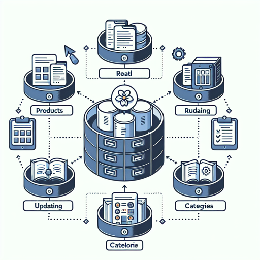

# Product Management
Manages product and category data within the retail system, providing operations for creating, reading, updating and deleting products, variants and categories.

**Capability Metadata**
| Property | Value |
|----------|------|
| Capability Code | `product-management` |

## Capability Images
| Medium | Small | Square |
|--------|-------|--------|
|  |  |  |

## Capability Operations

### Get Product
Retrieves detailed product information by ID

**Operation Metadata**
| Property | Value |
|----------|------|
| Operation Code | `get_product` |

#### Input Schema
```json operation input schema
{
  "type": "object",
  "properties": {
    "productId": {
      "type": "string"
    }
  },
  "required": [
    "productId"
  ]
}
```

#### Output Schema
```json operation output schema
{
  "type": "object",
  "properties": {
    "id": {
      "type": "string"
    },
    "name": {
      "type": "string"
    },
    "description": {
      "type": "string"
    },
    "price": {
      "type": "number"
    },
    "categoryId": {
      "type": "string"
    },
    "variants": {
      "type": "array",
      "items": {
        "type": "object",
        "properties": {
          "id": {
            "type": "string"
          },
          "sku": {
            "type": "string"
          },
          "attributes": {
            "type": "object"
          }
        }
      }
    }
  },
  "required": [
    "id",
    "name",
    "price"
  ]
}
```
### Create Product
Creates a new product in the system

**Operation Metadata**
| Property | Value |
|----------|------|
| Operation Code | `create_product` |

#### Input Schema
```json operation input schema
{
  "type": "object",
  "properties": {
    "name": {
      "type": "string"
    },
    "description": {
      "type": "string"
    },
    "price": {
      "type": "number"
    },
    "categoryId": {
      "type": "string"
    }
  },
  "required": [
    "name",
    "price"
  ]
}
```

#### Output Schema
```json operation output schema
{
  "type": "object",
  "properties": {
    "id": {
      "type": "string"
    },
    "name": {
      "type": "string"
    },
    "description": {
      "type": "string"
    },
    "price": {
      "type": "number"
    },
    "categoryId": {
      "type": "string"
    }
  },
  "required": [
    "id"
  ]
}
```
### Update Product
Updates an existing product's information

**Operation Metadata**
| Property | Value |
|----------|------|
| Operation Code | `update_product` |

#### Input Schema
```json operation input schema
{
  "type": "object",
  "properties": {
    "id": {
      "type": "string"
    },
    "name": {
      "type": "string"
    },
    "description": {
      "type": "string"
    },
    "price": {
      "type": "number"
    },
    "categoryId": {
      "type": "string"
    }
  },
  "required": [
    "id"
  ]
}
```

#### Output Schema
```json operation output schema
{
  "type": "object",
  "properties": {
    "success": {
      "type": "boolean"
    }
  },
  "required": [
    "success"
  ]
}
```
