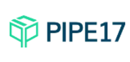

# Pipe17
Unified Order Operations For Leading Brands, Retailers & Fulfillment Providers

**Provider Metadata**
| Property | Value |
|----------|------|
| Provider Code | `pipe17` |
| Provider Image | |

## Provider Connection Types

### Pipe17 Connection
Default connection type for Pipe17 integration

**Connection Type Metadata**
| Property | Value|
|----------|------|
| Connection Type Code | `pipe17_default` |

#### API Key
Your Pipe17 API authentication key

**Connection Property Metadata**
| Property | Value|
|----------|------|
| Property Code | `api_key` |
| IsSecret | False |
| Property Level | client |
| Requried | False |
| Example Value | p17_xxxxxxxxxxxxx |

#### Environment
The Pipe17 environment to connect to (production or sandbox)

**Connection Property Metadata**
| Property | Value|
|----------|------|
| Property Code | `environment` |
| IsSecret | False |
| Property Level | client |
| Requried | False |
| Example Value | production |

#### Webhook URL
URL for receiving Pipe17 webhook notifications

**Connection Property Metadata**
| Property | Value|
|----------|------|
| Property Code | `webhook_url` |
| IsSecret | False |
| Property Level | client |
| Requried | False |
| Example Value | https://your-domain.com/webhook/pipe17 |

