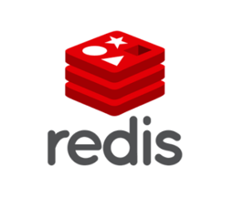

# Redis
High performance, low latency, distributed cache system.

**Provider Metadata**
| Property | Value |
|----------|------|
| Provider Code | `redis` |
| Provider Image | |

## Provider Connection Types

### Redis Standard Connection
The default way to connect to a Redis instance.

**Connection Type Metadata**
| Property | Value|
|----------|------|
| Connection Type Code | `redis-standard` |

#### Redis Host
The hostname or IP address of the Redis server

**Connection Property Metadata**
| Property | Value|
|----------|------|
| Property Code | `host` |
| IsSecret | False |
| Property Level | client |
| Requried | False |
| Example Value | localhost |

#### Port
The port number on which Redis server is listening

**Connection Property Metadata**
| Property | Value|
|----------|------|
| Property Code | `port` |
| IsSecret | False |
| Property Level | client |
| Requried | False |
| Example Value | 6379 |

#### Password
Authentication password for Redis server

**Connection Property Metadata**
| Property | Value|
|----------|------|
| Property Code | `password` |
| IsSecret | False |
| Property Level | client |
| Requried | False |
| Example Value | your-redis-password |

#### Database Number
The Redis database number to connect to

**Connection Property Metadata**
| Property | Value|
|----------|------|
| Property Code | `database` |
| IsSecret | False |
| Property Level | client |
| Requried | False |
| Example Value | 0 |

