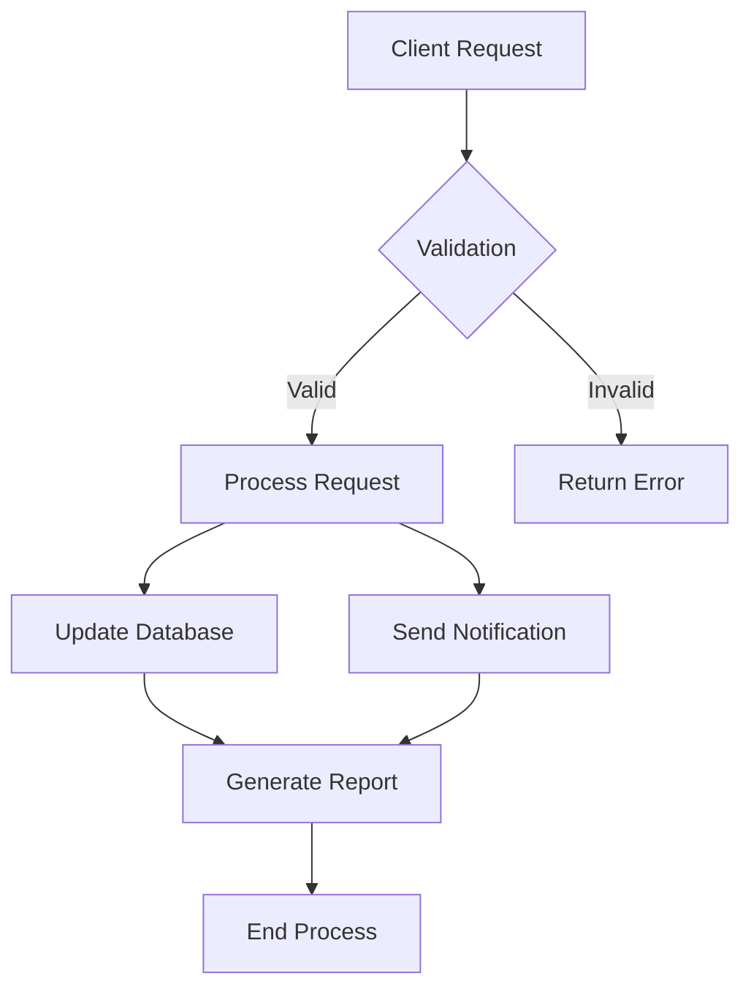

# ACME Account

This README provides an overview of the ACME account within our system.

## Overview

ACME is one of our primary accounts, representing a significant client in our portfolio. This account is managed through our `.genval/accounts/acme/` directory, which contains various configuration files and resources specific to ACME's needs.

## Account Structure

The ACME account directory is structured as follows:

```
.genval/accounts/acme/
├── README.md (this file)
├── config.yaml
└── other potential files and directories
```

## Key Information

- **Account Code**: acme
- **Account Type**: Primary Client
- **Main Contact**: [To be filled with actual contact information]

## Configuration

The `config.yaml` file in this directory contains the main configuration settings for the ACME account. This may include:

- API keys
- Environment variables
- Service configurations
- Feature flags

Always refer to this file for the most up-to-date configuration settings.

## Workflows



This diagram represents a typical workflow for handling ACME account requests. It includes validation, processing, database updates, notifications, and report generation.

## Important Notes

- Always ensure that any changes to the ACME account configuration are properly documented and communicated to the relevant team members.
- Regular security audits should be performed on the ACME account to ensure data integrity and protection.
- Any issues or anomalies related to the ACME account should be reported immediately to the account manager.

## Further Resources

- [ACME Client Portal](https://example.com/acme-portal) (replace with actual link)
- [Internal ACME Account Documentation](https://internal-docs.example.com/acme) (replace with actual link)

For any questions or concerns regarding the ACME account, please contact the account management team.