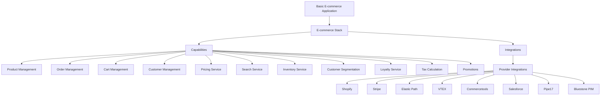

# Reference E-commerce Account

Welcome to the Reference E-commerce Account! This account serves as a comprehensive example of an e-commerce system, showcasing various capabilities, integrations, and applications that can be used to build a robust online retail platform.

## Overview

This account demonstrates the implementation of a modern e-commerce stack, incorporating essential features such as product management, order processing, customer management, and more. It's designed to provide developers and AI agents with a clear understanding of how different components work together in a real-world e-commerce scenario.

## Key Components

### Capabilities

The account includes several core e-commerce capabilities:

1. [Product Management](../reference-ecommerce/capability/product-management)
2. [Order Management](../reference-ecommerce/capability/order-management)
3. [Cart Management](../reference-ecommerce/capability/cart-management)
4. [Customer Management](../reference-ecommerce/capability/customer-management)
5. [Pricing Service](../reference-ecommerce/capability/pricing_service)
6. [Search Service](../reference-ecommerce/capability/search_service)
7. [Inventory Service](../reference-ecommerce/capability/inventory_service)
8. [Customer Segmentation](../reference-ecommerce/capability/customer_segmentation)
9. [Loyalty Service](../reference-ecommerce/capability/loyalty_service)
10. [Tax Calculation](../reference-ecommerce/capability/tax_calculation)
11. [Promotions](../reference-ecommerce/capability/promotions)

Each capability is designed to handle specific aspects of e-commerce operations, providing a modular approach to building a complete system.

### Providers

The account integrates with various e-commerce providers:

- [Shopify](../reference-ecommerce/provider/shopify)
- [Stripe](../reference-ecommerce/provider/stripe)
- [Elastic Path](../reference-ecommerce/provider/elastic-path)
- [VTEX](../reference-ecommerce/provider/vtex)
- [Commercetools](../reference-ecommerce/provider/commercetools)
- [Salesforce](../reference-ecommerce/provider/salesforce)
- [Pipe17](../reference-ecommerce/provider/pipe17)
- [Bluestone PIM](../reference-ecommerce/provider/bluestone-pim)

These providers offer various services and APIs that can be leveraged to enhance e-commerce functionality.

### Integrations

The account showcases how different capabilities can be integrated with specific providers:

- [Shopify Product Management Integration](../reference-ecommerce/integration/shopify-product-management)
- [Stripe Tax Integration](../reference-ecommerce/integration/stripe_tax_integration)
- [Elastic Path Cart Integration](../reference-ecommerce/integration/elastic-path-cart)
- [VTEX Product Management Integration](../reference-ecommerce/integration/vtex-product-management)
- [Salesforce Customer Segmentation Integration](../reference-ecommerce/integration/salesforce-customer-segmentation)
- [Pipe17 Order Management Integration](../reference-ecommerce/integration/p17_order_mgmt)
- [Bluestone PIM Product Integration](../reference-ecommerce/integration/bluestone-pim-product-mgmt)

These integrations demonstrate how to connect various e-commerce capabilities with specific provider APIs and services.

### Stacks

The account includes example e-commerce stacks that combine different capabilities and integrations:

- [Stripe Powered Stack](../reference-ecommerce/stack/stripe-powered-stack)
- [Shopify Powered Stack](../reference-ecommerce/stack/shopify-powered)
- [Elastic Path powered Commerce Stack](../reference-ecommerce/stack/ep-stack)

These stacks showcase how different components can be combined to create complete e-commerce solutions tailored to specific needs.

### Applications

The account features a sample e-commerce application:

- [Basic E-commerce Application](../reference-ecommerce/application/basic-ecommerce)

This application demonstrates how the various capabilities, integrations, and stacks can be used to build a functional e-commerce platform.

## Architecture Overview

Below is a high-level architecture diagram of the Reference E-commerce Account:

This diagram illustrates how the different components of the Reference E-commerce Account are interconnected, from the application layer down to the individual capabilities and provider integrations.

## Getting Started

To explore this reference e-commerce account:

1. Review the capabilities to understand the core functionalities available.
2. Examine the provider documentation to learn about the different e-commerce platforms and services integrated.
3. Study the integrations to see how capabilities are connected to specific providers.
4. Look at the stack examples to understand how different components can be combined.
5. Explore the Basic E-commerce Application to see a practical implementation of these components.

## Conclusion

This Reference E-commerce Account serves as a comprehensive guide and example for building robust e-commerce systems. By exploring the various components and their interactions, developers and AI agents can gain valuable insights into the architecture and implementation of modern e-commerce platforms.

For any questions or further information, please refer to the specific documentation for each component or contact the account administrator.