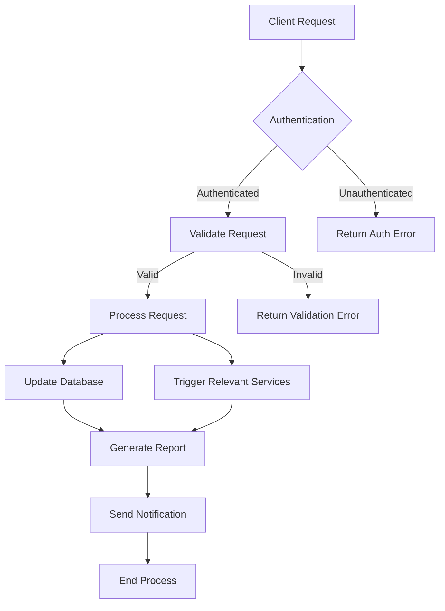

# Umbrella Corporation Account

This README provides an overview of the Umbrella Corporation account within our system.

## Overview

Umbrella Corporation is a significant account in our portfolio, known for its diverse range of products and services. This account is managed through our `.genval/accounts/umbrella-corp/` directory, which contains various configuration files and resources specific to Umbrella Corporation's requirements.

## Account Structure

The Umbrella Corporation account directory is structured as follows:

```
.genval/accounts/umbrella-corp/
├── README.md (this file)
├── config.yaml
└── other potential files and directories
```

## Key Information

- **Account Code**: umbrella-corp
- **Account Type**: Major Corporate Client
- **Main Contact**: [To be filled with actual contact information]

## Configuration

The `config.yaml` file in this directory contains the main configuration settings for the Umbrella Corporation account. This may include:

- API keys
- Environment variables
- Service configurations
- Feature flags

Always refer to this file for the most up-to-date configuration settings.

## Workflows



This diagram represents a typical workflow for handling Umbrella Corporation account requests. It includes authentication, validation, processing, database updates, service triggers, report generation, and notifications.

## Important Notes

- Due to the sensitive nature of Umbrella Corporation's work, extra security measures are in place. Always ensure you're following the highest security protocols when working with this account.
- Regular compliance checks should be performed to ensure all operations align with both our internal policies and Umbrella Corporation's requirements.
- Any unusual activities or requests should be immediately reported to the security team and the account manager.

## Further Resources

- [Umbrella Corporation Client Portal](https://example.com/umbrella-portal) (replace with actual link)
- [Internal Umbrella Corp Account Documentation](https://internal-docs.example.com/umbrella) (replace with actual link)
- [Security Protocols for Umbrella Corp Account](https://security-docs.example.com/umbrella) (replace with actual link)

For any questions or concerns regarding the Umbrella Corporation account, please contact the dedicated account management team.