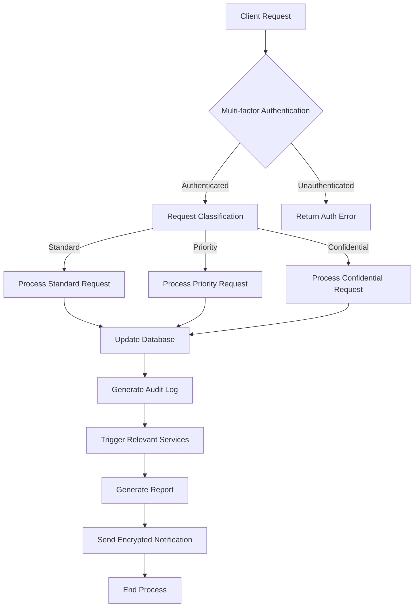

# Wayne Enterprises Account

This README provides an overview of the Wayne Enterprises account within our system.

## Overview

Wayne Enterprises is a prestigious account in our portfolio, known for its diverse business interests and technological innovations. This account is managed through our `.genval/accounts/wayne-enterprises/` directory, which contains various configuration files and resources specific to Wayne Enterprises' requirements.

## Account Structure

The Wayne Enterprises account directory is structured as follows:

```
.genval/accounts/wayne-enterprises/
├── README.md (this file)
├── config.yaml
└── other potential files and directories
```

## Key Information

- **Account Code**: wayne-enterprises
- **Account Type**: Premium Corporate Client
- **Main Contact**: [To be filled with actual contact information]

## Configuration

The `config.yaml` file in this directory contains the main configuration settings for the Wayne Enterprises account. This may include:

- API keys
- Environment variables
- Service configurations
- Feature flags
- Custom integrations

Always refer to this file for the most up-to-date configuration settings.

## Workflows



This diagram represents a typical workflow for handling Wayne Enterprises account requests. It includes multi-factor authentication, request classification, processing based on request type, database updates, audit logging, service triggers, report generation, and encrypted notifications.

## Important Notes

- Wayne Enterprises requires the highest level of security and confidentiality. Always ensure you're following the most stringent security protocols when working with this account.
- Regular security audits and penetration testing should be performed on all systems and processes related to this account.
- Any suspicious activities, no matter how minor, should be immediately reported to the security team and the account manager.
- Innovation is key for Wayne Enterprises. Be prepared to adapt our services to meet their cutting-edge requirements.

## Special Considerations

1. **Gotham City Projects**: Wayne Enterprises often requires special handling for projects related to Gotham City infrastructure. These may require additional approvals and security measures.

2. **R&D Collaborations**: Be aware of potential collaborations with Wayne Enterprises' R&D department. These projects may involve advanced technologies and require specialized knowledge.

3. **Philanthropy Integration**: Wayne Enterprises has a strong focus on philanthropy. Some requests may be related to charitable projects and should be handled with appropriate sensitivity.

## Further Resources

- [Wayne Enterprises Client Portal](https://example.com/wayne-portal) (replace with actual link)
- [Internal Wayne Enterprises Account Documentation](https://internal-docs.example.com/wayne) (replace with actual link)
- [Security Protocols for Wayne Enterprises Account](https://security-docs.example.com/wayne) (replace with actual link)
- [Innovation Pipeline for Wayne Enterprises](https://innovation.example.com/wayne) (replace with actual link)

For any questions or concerns regarding the Wayne Enterprises account, please contact the dedicated account management team or the special projects division.