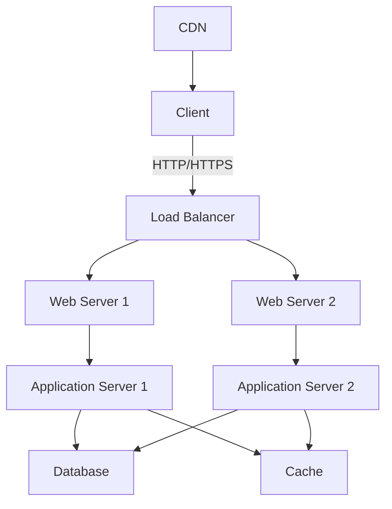

# Cloud-Based Web Application Stack

This README provides an overview of our cloud-based web application stack, including its architecture and deployment instructions.

## Architecture Overview

Our web application stack consists of the following components:

1. **Client**: The user's web browser or mobile app.
2. **CDN (Content Delivery Network)**: Serves static assets globally for improved performance.
3. **Load Balancer**: Distributes incoming traffic across multiple web servers.
4. **Web Servers**: Handle HTTP requests and serve static content.
5. **Application Servers**: Process business logic and dynamic content.
6. **Database**: Stores and manages application data.
7. **Cache**: Improves performance by storing frequently accessed data.

## Deployment Instructions

### 1. Set up Cloud Infrastructure

1. Choose a cloud provider (e.g., AWS, Azure, or Google Cloud).
2. Create a Virtual Private Cloud (VPC) with public and private subnets.
3. Set up security groups and network ACLs.

### 2. Deploy Database

1. Launch a managed database service (e.g., Amazon RDS, Azure Database, or Google Cloud SQL).
2. Configure backup and replication settings.
3. Set up appropriate security measures (encryption, access controls).

### 3. Deploy Cache

1. Set up a managed cache service (e.g., Amazon ElastiCache, Azure Cache for Redis, or Google Cloud Memorystore).
2. Configure cache settings (size, eviction policies).

### 4. Deploy Application Servers

1. Create virtual machines or use container orchestration (e.g., Kubernetes).
2. Install necessary runtime environments and dependencies.
3. Deploy application code to the servers.
4. Configure environment variables and connection strings.

### 5. Deploy Web Servers

1. Set up web servers (e.g., Nginx, Apache) on virtual machines or containers.
2. Configure SSL/TLS certificates for HTTPS.
3. Set up reverse proxy to route requests to application servers.

### 6. Set up Load Balancer

1. Create a managed load balancer service (e.g., AWS ELB, Azure Load Balancer, or Google Cloud Load Balancing).
2. Configure health checks and SSL termination.
3. Add web servers to the load balancer pool.

### 7. Configure CDN

1. Set up a CDN service (e.g., Amazon CloudFront, Azure CDN, or Google Cloud CDN).
2. Configure origin servers and caching rules.
3. Set up custom domain and SSL certificate for the CDN.

### 8. Monitoring and Logging

1. Set up centralized logging (e.g., ELK stack, Splunk, or cloud-native solutions).
2. Configure monitoring and alerting for all components.
3. Set up performance metrics and dashboards.

### 9. Continuous Integration/Continuous Deployment (CI/CD)

1. Set up a CI/CD pipeline using tools like Jenkins, GitLab CI, or cloud-native solutions.
2. Configure automated testing and deployment processes.
3. Implement rollback procedures for failed deployments.

### 10. Security Measures

1. Implement Web Application Firewall (WAF) for additional security.
2. Set up DDoS protection.
3. Regularly update and patch all components.
4. Implement proper IAM roles and permissions.

## Conclusion

This README provides a high-level overview of the cloud-based web application stack and its deployment process. For detailed, step-by-step instructions specific to your chosen cloud provider and technologies, please refer to their respective documentation and best practices guides.

Remember to always follow security best practices, implement proper monitoring, and have a disaster recovery plan in place for your production environment.