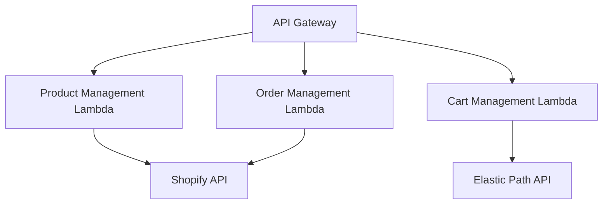

# Shopify Powered Stack

This project contains an AWS CDK stack that deploys a serverless e-commerce backend powered by Shopify and Elastic Path. It sets up an API Gateway with Lambda functions for product management, order management, and cart management.

## Architecture



## Prerequisites

1. Node.js (v14.x or later)
2. AWS CLI configured with appropriate credentials
3. AWS CDK CLI installed (`npm install -g aws-cdk`)
4. Shopify account with API access
5. Elastic Path account with API access

## Environment Variables

Before deploying, make sure to set the following environment variables:

- `SHOPIFY_SHOP_DOMAIN`: Your Shopify shop domain
- `SHOPIFY_ACCESS_TOKEN`: Your Shopify API access token
- `SHOPIFY_API_VERSION`: Shopify API version to use
- `ELASTIC_PATH_API_BASE_URL`: Elastic Path API base URL
- `ELASTIC_PATH_CLIENT_ID`: Elastic Path client ID
- `ELASTIC_PATH_CLIENT_SECRET`: Elastic Path client secret

## Deployment

1. Clone the repository:

```bash
git clone <repository-url>
cd shopify-powered-stack
```

2. Install dependencies:

```bash
npm install
```

3. Build the project:

```bash
npm run build
```

4. Deploy the stack:

```bash
cdk deploy
```

After successful deployment, the CDK will output the API Gateway URL, which you can use to access your e-commerce backend.

## API Endpoints

- `/product-management/*`: Product management operations (Shopify)
- `/order-management/*`: Order management operations (Shopify)
- `/cart-management/*`: Cart management operations (Elastic Path)

## Testing

To run the unit tests:

```bash
npm test
```

## Cleanup

To remove the stack from your AWS account:

```bash
cdk destroy
```

## Contributing

Please read CONTRIBUTING.md for details on our code of conduct, and the process for submitting pull requests.

## License

This project is licensed under the MIT License - see the LICENSE file for details.