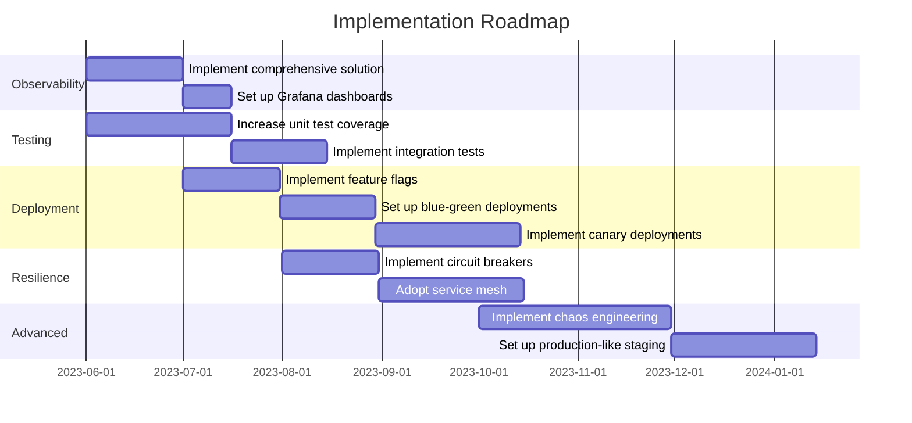

# DORA Metrics Assessment for Cloud-Based E-Commerce System

## Executive Summary

### Overall DORA Readiness Scores

| DORA Metric | Readiness Score |
|-------------|-----------------|
| Deployment Frequency | Medium |
| Lead Time for Changes | Medium |
| Mean Time to Recovery (MTTR) | Medium |
| Change Failure Rate | Medium |

### Key Architectural Strengths
1. Cloud-based infrastructure enabling scalability and flexibility
2. Microservices architecture promoting service independence
3. Continuous deployment model in place
4. Integration with modern e-commerce platforms and payment systems

### Key Architectural Concerns
1. Potential bottlenecks in deployment pipeline
2. Lack of comprehensive observability and monitoring
3. Insufficient automated testing coverage
4. Limited implementation of resilience patterns

### Critical Recommendations
1. Implement comprehensive observability and monitoring solution
2. Enhance automated testing coverage across all services
3. Adopt feature flagging for safer and more frequent deployments
4. Implement advanced deployment strategies (e.g., blue-green, canary)
5. Enhance service resilience with circuit breakers and retry mechanisms

## Detailed Analysis

### 1. Deployment Frequency

#### Current Architectural Support
The system utilizes a continuous deployment model, which is a good foundation for high deployment frequency. The microservices architecture allows for independent service deployments, potentially increasing overall deployment frequency.

#### Identified Risks and Bottlenecks
1. Lack of advanced deployment strategies may lead to hesitancy in frequent deployments
2. Potential interdependencies between services could hinder independent deployments
3. Insufficient automated testing may slow down the deployment process

#### Improvement Opportunities
1. Implement feature flags to decouple deployment from release
2. Adopt blue-green or canary deployment strategies
3. Enhance build and deployment automation

#### Specific Technical Recommendations
1. Implement a feature flagging system (e.g., LaunchDarkly, Split.io)
2. Set up blue-green deployment using Kubernetes or cloud-native services
3. Enhance CI/CD pipelines with parallel test execution and optimized build processes

#### Required Architectural Changes
1. Introduce a feature flag management service
2. Modify deployment pipelines to support advanced deployment strategies
3. Refactor services to support runtime configuration changes

### 2. Lead Time for Changes

#### Current Architectural Support
The microservices architecture and continuous deployment model provide a good foundation for reducing lead time. However, there are opportunities for improvement in the build and test phases.

#### Identified Risks and Bottlenecks
1. Potential long-running tests slowing down the pipeline
2. Manual approval processes that may introduce delays
3. Insufficient test coverage leading to longer manual testing phases

#### Improvement Opportunities
1. Optimize test execution through parallelization and selective testing
2. Implement trunk-based development to reduce integration time
3. Enhance automated code review processes

#### Specific Technical Recommendations
1. Implement test parallelization in CI/CD pipeline
2. Set up trunk-based development workflow with short-lived feature branches
3. Integrate automated code quality tools (e.g., SonarQube) into the CI pipeline

#### Required Architectural Changes
1. Refactor test suites to support parallelization
2. Modify CI/CD pipelines to support trunk-based development
3. Integrate code quality gates into the deployment pipeline

### 3. Mean Time to Recovery (MTTR)

#### Current Architectural Support
The cloud-based infrastructure provides some inherent resilience, but there's a lack of comprehensive observability and automated recovery mechanisms.

#### Identified Risks and Bottlenecks
1. Insufficient monitoring and alerting may lead to delayed issue detection
2. Lack of automated rollback mechanisms could prolong recovery time
3. Limited implementation of resilience patterns may result in cascading failures

#### Improvement Opportunities
1. Implement comprehensive observability solution
2. Enhance service resilience with circuit breakers and retry mechanisms
3. Implement automated rollback capabilities

#### Specific Technical Recommendations
1. Implement distributed tracing using Jaeger or Zipkin
2. Use Prometheus and Grafana for metrics collection and visualization
3. Implement circuit breakers using Hystrix or Resilience4j
4. Set up automated rollback triggers based on error rates or performance metrics

#### Required Architectural Changes
1. Integrate observability tools into all services
2. Implement a service mesh (e.g., Istio) for advanced traffic management and resilience
3. Modify deployment pipelines to support automated rollbacks

### 4. Change Failure Rate

#### Current Architectural Support
The continuous deployment model provides a foundation for reducing change failure rate, but there's room for improvement in testing and deployment strategies.

#### Identified Risks and Bottlenecks
1. Insufficient automated testing coverage may lead to undetected issues
2. Lack of gradual rollout strategies increases the impact of failures
3. Limited production-like testing environments may result in environment-specific issues

#### Improvement Opportunities
1. Enhance automated testing coverage
2. Implement canary deployments for gradual rollouts
3. Improve production-like testing environments

#### Specific Technical Recommendations
1. Increase unit test coverage to at least 80% across all services
2. Implement integration and end-to-end tests using tools like Cypress or Selenium
3. Set up canary deployments using Kubernetes or cloud-native services
4. Use chaos engineering practices to proactively identify weaknesses

#### Required Architectural Changes
1. Modify CI/CD pipelines to enforce test coverage thresholds
2. Implement a canary deployment infrastructure
3. Set up production-like staging environments with production data subsetting

## Implementation Roadmap

### Prioritized Improvements

1. High Priority (Quick Wins)
   - Implement comprehensive observability solution
   - Increase unit test coverage
   - Set up automated code quality checks

2. Medium Priority
   - Implement feature flagging system
   - Adopt blue-green deployment strategy
   - Enhance service resilience with circuit breakers

3. Low Priority (Long-term Investments)
   - Implement canary deployments
   - Adopt chaos engineering practices
   - Implement production-like staging environments

### Dependencies

- Observability implementation should precede advanced deployment strategies
- Increased test coverage is necessary before implementing stricter deployment gates
- Feature flagging system should be in place before adopting trunk-based development

### Estimated Complexity

- High Complexity: Canary deployments, Production-like staging environments
- Medium Complexity: Observability implementation, Service mesh adoption
- Low Complexity: Increasing unit test coverage, Implementing feature flags

## Risk Assessment

### Technical Risks
1. Integration challenges with existing systems during observability implementation
2. Potential performance impact of added resilience mechanisms
3. Learning curve for new deployment strategies and tools

### Operational Risks
1. Increased system complexity with the addition of new tools and practices
2. Potential for initial increase in false positives from new monitoring systems
3. Resistance to change from development and operations teams

### Security Implications
1. Increased attack surface with the introduction of new tools and services
2. Potential for data exposure in production-like staging environments
3. Need for secure management of feature flags and canary deployments

### Scalability Concerns
1. Ensuring observability solutions can handle increased data volume as the system grows
2. Maintaining deployment frequency as the number of services increases
3. Scaling test execution to maintain quick feedback as test coverage expands

## Monitoring Strategy

### Key Metrics to Track

1. DORA Metrics
   - Deployment Frequency
   - Lead Time for Changes
   - Mean Time to Recovery
   - Change Failure Rate

2. System Health
   - Error rates per service
   - Latency percentiles (p95, p99)
   - CPU and memory usage
   - Queue lengths and processing times

3. Business Metrics
   - Conversion rates
   - Cart abandonment rates
   - Order volume and value

### Recommended Monitoring Implementation

1. Distributed Tracing: Implement Jaeger for end-to-end request tracing
2. Metrics Collection: Use Prometheus for metrics gathering and storage
3. Visualization: Set up Grafana dashboards for metrics visualization
4. Log Aggregation: Implement ELK stack (Elasticsearch, Logstash, Kibana) for log management
5. Alerting: Configure Alertmanager for intelligent alert routing and management

### Alert Threshold Recommendations

1. Error Rate: Alert if error rate exceeds 1% for any service
2. Latency: Alert if p95 latency exceeds 500ms for critical services
3. CPU Usage: Alert if CPU usage exceeds 80% for more than 5 minutes
4. Memory Usage: Alert if memory usage exceeds 85% for any service
5. Deployment Failures: Alert on any failed deployments

### Observability Improvements

1. Implement custom instrumentation for business-critical transactions
2. Set up synthetic monitoring for key user journeys
3. Implement real user monitoring (RUM) for frontend performance tracking
4. Create service dependency maps for better understanding of system architecture
5. Implement anomaly detection using machine learning algorithms

By implementing these recommendations and continuously iterating on the process, the e-commerce system can significantly improve its DORA metrics performance and move towards elite-level DevOps practices.

This Gantt chart provides a visual representation of the implementation roadmap, showing the sequence and duration of key improvements. It helps in understanding the timeline and dependencies between different initiatives aimed at enhancing the system's DORA metrics performance.