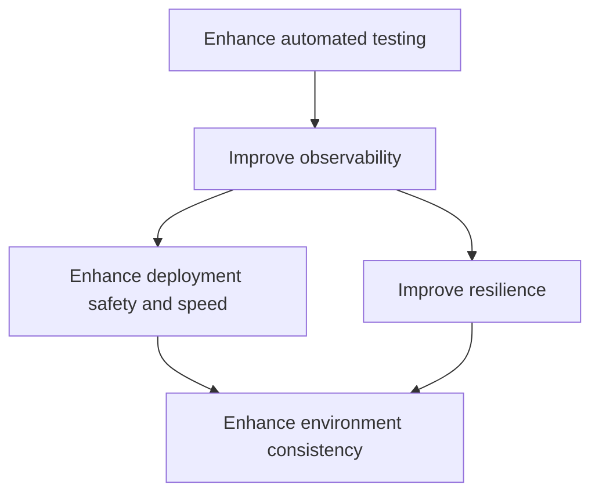

# DORA Metrics Assessment Report

## 1. Executive Summary

### Overall DORA Readiness Scores

| Metric | Score |
|--------|-------|
| Deployment Frequency | Medium |
| Lead Time for Changes | Medium |
| Mean Time to Recovery (MTTR) | Medium |
| Change Failure Rate | Medium |

### Key Architectural Strengths

1. Microservices architecture enabling independent deployments
2. Use of modern cloud technologies and containerization
3. Implemented caching and distributed systems for improved performance
4. Integration of monitoring and logging services

### Key Architectural Concerns

1. Lack of comprehensive automated testing across all services
2. Potential bottlenecks in the deployment pipeline
3. Limited observability and tracing implementations
4. Inconsistent error handling and resilience patterns

### Critical Recommendations

1. Implement comprehensive automated testing strategy
2. Enhance observability with distributed tracing
3. Standardize error handling and implement circuit breakers
4. Optimize CI/CD pipeline for faster deployments

## 2. Detailed Analysis

### 2.1 Deployment Frequency

#### Current Architectural Support
The microservices architecture and use of containerization provide a good foundation for frequent deployments. The presence of a CI/CD pipeline (inferred from the continuous deployment model) is also beneficial.

#### Identified Risks and Bottlenecks
1. Potential coupling between services may hinder independent deployments
2. Lack of automated testing may slow down deployment confidence
3. Manual steps in the deployment process could reduce frequency

#### Improvement Opportunities
1. Implement feature flags for safer, more frequent releases
2. Enhance automated testing to increase deployment confidence
3. Optimize Docker builds and container orchestration

#### Specific Technical Recommendations
1. Implement a feature flag management system (e.g., LaunchDarkly, Split.io)
2. Increase unit test coverage across all services
3. Implement automated integration and end-to-end tests
4. Optimize Dockerfile and Kubernetes configurations for faster builds and deployments

#### Required Architectural Changes
1. Introduce a feature flag management service
2. Enhance the CI/CD pipeline to include more comprehensive automated testing
3. Implement blue-green or canary deployment strategies

### 2.2 Lead Time for Changes

#### Current Architectural Support
The microservices architecture allows for parallel development and potentially faster lead times. The use of modern cloud technologies can also contribute to faster provisioning and deployment.

#### Identified Risks and Bottlenecks
1. Lack of comprehensive automated testing may increase time spent on manual testing
2. Potential interdependencies between services may slow down changes
3. Insufficient environment parity may lead to issues discovered late in the process

#### Improvement Opportunities
1. Implement trunk-based development
2. Enhance automated testing at all levels
3. Improve environment parity between development and production

#### Specific Technical Recommendations
1. Implement automated code quality checks (e.g., SonarQube)
2. Introduce contract testing between services (e.g., Pact)
3. Implement infrastructure-as-code for consistent environments (e.g., Terraform)
4. Enhance CI/CD pipeline with parallel test execution

#### Required Architectural Changes
1. Introduce a code quality service
2. Implement a contract testing framework
3. Develop infrastructure-as-code templates for all environments

### 2.3 Mean Time to Recovery (MTTR)

#### Current Architectural Support
The presence of logging services and some level of monitoring provides a foundation for identifying and resolving issues. The microservices architecture allows for isolated failures and potentially faster recovery.

#### Identified Risks and Bottlenecks
1. Lack of comprehensive distributed tracing may slow down root cause analysis
2. Inconsistent error handling across services may lead to cascading failures
3. Limited automated rollback capabilities could increase recovery time

#### Improvement Opportunities
1. Implement distributed tracing across all services
2. Standardize error handling and implement circuit breakers
3. Enhance monitoring and alerting capabilities
4. Implement automated rollback mechanisms

#### Specific Technical Recommendations
1. Implement distributed tracing (e.g., Jaeger, Zipkin)
2. Implement circuit breakers (e.g., Hystrix, Resilience4j)
3. Enhance monitoring with APM tools (e.g., New Relic, Datadog)
4. Implement automated rollback in CI/CD pipeline

#### Required Architectural Changes
1. Introduce a distributed tracing service
2. Implement a circuit breaker pattern in all services
3. Enhance the monitoring and alerting architecture

### 2.4 Change Failure Rate

#### Current Architectural Support
The microservices architecture allows for isolated deployments, potentially reducing the blast radius of changes. The use of containerization can also contribute to consistency between environments.

#### Identified Risks and Bottlenecks
1. Lack of comprehensive automated testing may lead to undetected issues
2. Insufficient production-like testing environments may result in environment-specific failures
3. Limited use of feature flags may increase the risk of failed changes

#### Improvement Opportunities
1. Implement comprehensive automated testing strategy
2. Enhance production-like testing environments
3. Implement feature flags for safer releases
4. Enhance monitoring and alerting for early detection of issues

#### Specific Technical Recommendations
1. Implement mutation testing to improve test quality (e.g., Pitest)
2. Use service virtualization for more accurate integration testing (e.g., Mountebank)
3. Implement chaos engineering practices (e.g., Chaos Monkey)
4. Enhance logging and implement log aggregation (e.g., ELK stack)

#### Required Architectural Changes
1. Introduce a mutation testing service
2. Implement a service virtualization layer
3. Introduce a chaos engineering service
4. Enhance the logging and log aggregation architecture

## 3. Implementation Roadmap

### Prioritized List of Architectural Improvements

1. Enhance automated testing
   - Implement unit testing across all services
   - Introduce integration and end-to-end testing
   - Implement contract testing between services

2. Improve observability
   - Implement distributed tracing
   - Enhance logging and implement log aggregation
   - Improve monitoring and alerting capabilities

3. Enhance deployment safety and speed
   - Implement feature flag management
   - Introduce blue-green or canary deployment strategies
   - Optimize CI/CD pipeline

4. Improve resilience
   - Implement circuit breakers
   - Standardize error handling across services
   - Introduce chaos engineering practices

5. Enhance environment consistency
   - Implement infrastructure-as-code
   - Improve production-like testing environments

### Dependencies between Improvements

### Estimated Complexity of Changes

| Improvement | Complexity |
|-------------|------------|
| Enhance automated testing | High |
| Improve observability | Medium |
| Enhance deployment safety and speed | Medium |
| Improve resilience | High |
| Enhance environment consistency | Medium |

### Quick Wins vs. Long-term Investments

Quick Wins:
1. Implement basic unit testing across services
2. Enhance logging and implement log aggregation
3. Implement feature flags for key services

Long-term Investments:
1. Implement comprehensive automated testing strategy
2. Introduce distributed tracing across all services
3. Implement chaos engineering practices
4. Enhance overall architecture for improved resilience and scalability

## 4. Risk Assessment

### Technical Risks

1. Increased complexity due to introduction of new tools and services
2. Potential performance impact from enhanced logging and tracing
3. Learning curve for new practices (e.g., chaos engineering)

### Operational Risks

1. Increased operational overhead for managing new tools and services
2. Potential for initial increase in false positives from new monitoring
3. Risk of service disruption during implementation of new practices

### Security Implications

1. Increased attack surface with introduction of new services
2. Potential for sensitive data exposure in enhanced logging and tracing
3. Need for secure management of feature flags and deployment strategies

### Scalability Concerns

1. Ensure new observability tools can handle increased load as system grows
2. Consider impact of enhanced testing on CI/CD pipeline performance
3. Ensure feature flag system can scale with increasing number of flags and services

## 5. Monitoring Strategy

### Key Metrics to Track

1. Deployment frequency per service
2. Lead time for changes (time from commit to production)
3. Mean Time to Recovery (MTTR) per incident
4. Change failure rate per service
5. Error rates per service
6. Service response times
7. CPU and memory usage per service
8. Queue lengths and processing times
9. Cache hit rates
10. Database query performance

### Recommended Monitoring Implementations

1. Implement APM tool (e.g., New Relic, Datadog) for overall application performance monitoring
2. Use Prometheus for metrics collection and Grafana for visualization
3. Implement ELK stack (Elasticsearch, Logstash, Kibana) for log aggregation and analysis
4. Use distributed tracing tool (e.g., Jaeger, Zipkin) for request flow monitoring
5. Implement synthetic monitoring for critical user journeys

### Alert Threshold Recommendations

1. Error rate: Alert when error rate exceeds 1% for any service
2. Response time: Alert when 95th percentile response time exceeds 500ms
3. CPU usage: Alert when CPU usage exceeds 80% for more than 5 minutes
4. Memory usage: Alert when memory usage exceeds 85% for more than 5 minutes
5. MTTR: Alert when MTTR exceeds 1 hour for any incident
6. Deployment failures: Alert on any failed deployment

### Observability Improvements

1. Implement distributed tracing across all services
2. Enhance logging with structured log formats and consistent correlation IDs
3. Implement service mesh (e.g., Istio) for improved network-level observability
4. Create unified dashboards for DevOps metrics
5. Implement real-user monitoring (RUM) for frontend performance tracking

By implementing these recommendations, the organization can significantly improve its DORA metrics performance and move towards a higher performance level. Regular reassessment and continuous improvement will be key to maintaining and furthering progress in these areas.