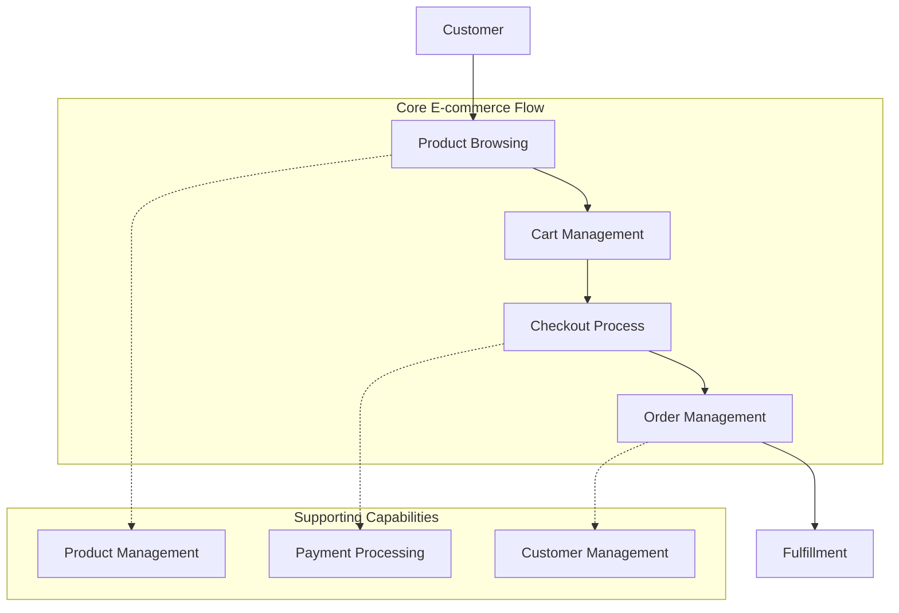

# E-commerce System Flow Framework Assessment

## Executive Summary

This assessment evaluates the current e-commerce system architecture through the lens of the Flow Framework, focusing on the four Flow Metrics (Velocity, Time, Efficiency, and Load) and the four Flow Items (Features, Defects, Risk, and Debt). The analysis reveals a system with a solid foundation for supporting e-commerce operations but with significant opportunities for improvement in flow optimization and value stream integration.

### Key Findings:

1. The modular architecture of capabilities and integrations provides a good basis for flow management but lacks comprehensive end-to-end visibility.
2. There is strong support for feature deployment and business value tracking, particularly in product and order management.
3. The system shows potential for efficient defect and risk management, but these areas need further development and integration.
4. Technical debt management is not explicitly addressed in the current architecture, presenting a significant area for improvement.
5. The integration of multiple providers (e.g., Shopify, Stripe, Elastic Path) offers flexibility but may introduce complexity in measuring and optimizing flow across the entire value stream.

### Critical Recommendations:

1. Implement an overarching value stream management tool to provide end-to-end visibility and flow metric tracking.
2. Enhance integration between capabilities to reduce handoff times and improve flow efficiency.
3. Develop a comprehensive strategy for technical debt tracking and management.
4. Strengthen defect tracking and quality assurance processes across all capabilities.
5. Implement robust security and compliance checks throughout the value stream.

## Flow Metrics Analysis

### 1. Flow Velocity

Current Architectural Support: Moderate
- The modular capability structure allows for parallel development and deployment of different e-commerce functionalities.
- Integration with multiple providers enables flexible and potentially rapid feature delivery.

Measurement Capabilities: Limited
- Lacks a centralized system for tracking completion rates across all capabilities and integrations.
- Individual capabilities (e.g., Order Management, Product Management) have potential for tracking feature completion, but this is not standardized across the system.

Identified Bottlenecks:
- Multiple integrations may lead to synchronization issues, potentially slowing down overall velocity.
- Lack of standardized tracking across capabilities may result in inconsistent velocity measurements.

Improvement Opportunities:
- Implement a centralized tracking system for all flow items across capabilities and integrations.
- Standardize velocity metrics and measurement processes across all components of the e-commerce system.

Technical Recommendations:
- Integrate a value stream management tool that can aggregate data from all capabilities and providers.
- Implement API-level tracking for all integrations to measure throughput and identify bottlenecks.

### 2. Flow Time

Current Architectural Support: Moderate
- The separation of concerns between capabilities (e.g., Cart Management, Order Management) allows for potential optimization of individual process steps.
- Integration with specialized services (e.g., Stripe for payments, Shopify for order management) can potentially reduce processing times for specific operations.

Measurement Capabilities: Limited
- Lack of end-to-end process visibility makes it challenging to measure total flow time accurately.
- Individual capabilities may track their own processing times, but there's no apparent system for aggregating this data across the entire value stream.

Identified Bottlenecks:
- Handoffs between different capabilities and external integrations may introduce delays.
- Lack of visibility into queue times between process steps.

Improvement Opportunities:
- Implement end-to-end process tracking to identify and optimize the critical path.
- Reduce handoff times between capabilities and external integrations.

Technical Recommendations:
- Introduce distributed tracing across all capabilities and integrations to track end-to-end flow time.
- Implement asynchronous processing and event-driven architecture where appropriate to reduce wait times.

### 3. Flow Efficiency

Current Architectural Support: Low to Moderate
- The modular architecture allows for potential parallel processing, which could improve efficiency.
- Specialized integrations (e.g., Elastic Path for pricing, Stripe for payments) may provide efficient processing for specific tasks.

Measurement Capabilities: Limited
- No apparent system for distinguishing between active work and wait states across the value stream.
- Lack of standardized efficiency metrics across capabilities and integrations.

Identified Bottlenecks:
- Potential for queue buildup between capabilities, especially during high-load periods.
- Manual interventions or approvals may introduce significant wait times.

Improvement Opportunities:
- Implement queue monitoring and management across all capabilities.
- Automate handoffs between capabilities and integrations where possible.

Technical Recommendations:
- Introduce a message queue system (e.g., RabbitMQ, Apache Kafka) for managing work items between capabilities.
- Implement real-time monitoring and alerting for queue buildups and processing delays.

### 4. Flow Load

Current Architectural Support: Moderate
- The separation of capabilities allows for potential load balancing and scaling of individual components.
- Multiple provider integrations provide options for distributing load across different services.

Measurement Capabilities: Limited
- Lack of centralized WIP tracking across the entire system.
- Individual capabilities may have their own load management, but this is not standardized or integrated.

Identified Bottlenecks:
- Potential for uneven load distribution across capabilities and integrations.
- Lack of visibility into system-wide capacity and utilization.

Improvement Opportunities:
- Implement system-wide WIP limits and load balancing.
- Develop capacity planning and predictive scaling capabilities.

Technical Recommendations:
- Integrate a centralized monitoring and alerting system for tracking load across all capabilities and integrations.
- Implement auto-scaling for cloud-based components to handle variable load.

## Flow Items Analysis

### 1. Features (Business Value)

Tracking Capabilities: Moderate to Strong
- Product Management and Order Management capabilities provide good support for feature tracking.
- Integration with e-commerce platforms like Shopify and Elastic Path enables feature deployment and management.

Processing Efficiency: Moderate
- Modular architecture allows for independent feature development and deployment.
- Multiple integrations provide flexibility but may introduce complexity in feature rollouts.

Integration Effectiveness: Moderate
- Good integration between core e-commerce functionalities (e.g., product, cart, order management).
- Potential for improved integration with customer-facing features and analytics.

Measurement Systems: Limited to Moderate
- Capability for tracking basic e-commerce metrics (orders, sales) exists.
- Lack of comprehensive system for measuring feature impact and business value across the entire platform.

Improvement Recommendations:
- Implement a feature flagging system for controlled rollouts and A/B testing.
- Develop a centralized dashboard for tracking feature usage, adoption, and business impact.
- Enhance integration between feature deployment and business metrics tracking.

### 2. Defects (Quality)

Tracking Capabilities: Limited
- No explicit defect tracking system mentioned in the current architecture.
- Potential for basic error handling within individual capabilities and integrations.

Processing Efficiency: Low to Moderate
- Modular architecture allows for isolated debugging and fixes.
- Lack of standardized defect management process across capabilities.

Integration Effectiveness: Low
- No apparent integration between defect tracking and other systems (e.g., customer support, order management).

Measurement Systems: Limited
- Lack of centralized quality metrics and defect tracking across the platform.

Improvement Recommendations:
- Implement a comprehensive defect tracking system integrated with all capabilities.
- Develop automated testing frameworks for each capability and integration.
- Establish quality gates and metrics for the entire e-commerce platform.
- Integrate defect tracking with customer support and order management systems for faster resolution.

### 3. Risk (Security/Compliance)

Tracking Capabilities: Limited to Moderate
- Some inherent security features in payment integrations (e.g., Stripe).
- Lack of explicit risk tracking and management across the entire system.

Processing Efficiency: Low to Moderate
- Potential for efficient handling of payment-related risks through specialized integrations.
- Lack of standardized risk assessment and mitigation processes across capabilities.

Integration Effectiveness: Low
- Limited evidence of integrated security and compliance checks across capabilities.

Measurement Systems: Limited
- No apparent centralized system for tracking and measuring security and compliance risks.

Improvement Recommendations:
- Implement a comprehensive security and compliance management system.
- Integrate automated security scanning and compliance checking into the development and deployment processes.
- Develop a centralized dashboard for monitoring and reporting on security and compliance risks.
- Establish regular security audits and penetration testing processes.

### 4. Debt (Technical)

Tracking Capabilities: Low
- No explicit system for tracking or managing technical debt mentioned in the architecture.

Processing Efficiency: Low
- Lack of standardized processes for addressing technical debt.

Integration Effectiveness: Low
- No apparent integration between technical debt management and other development processes.

Measurement Systems: Low
- Absence of metrics or tracking systems for technical debt.

Improvement Recommendations:
- Implement a technical debt tracking system integrated with the development workflow.
- Establish regular code quality checks and architectural reviews.
- Develop metrics for measuring and prioritizing technical debt.
- Allocate dedicated time and resources for addressing technical debt as part of the regular development cycle.

## Value Stream Architecture

### Integration Point Analysis:
1. Product Management to Product Browsing: Potential for optimization in real-time inventory and pricing updates.
2. Cart Management to Checkout: Opportunity for streamlining cart validation and pre-checkout processes.
3. Checkout to Payment Processing: Critical integration point, requires robust error handling and retry mechanisms.
4. Order Management to Customer Management: Potential for enhancing post-purchase customer engagement.

### Handoff Optimization:
1. Implement event-driven architecture for real-time updates between capabilities.
2. Utilize caching mechanisms to reduce API calls and improve response times.
3. Develop standardized data models to ensure consistency across handoffs.

### Queue Management:
1. Implement a distributed queue system (e.g., Apache Kafka) for managing workloads between capabilities.
2. Develop priority queuing for critical operations (e.g., payment processing, order confirmation).
3. Implement back-pressure mechanisms to handle traffic spikes and prevent system overload.

### Load Balancing Recommendations:
1. Utilize cloud-native auto-scaling for each capability to handle variable load.
2. Implement circuit breakers and fallback mechanisms for external integrations.
3. Develop a smart routing system to distribute requests across multiple instances or providers based on current load and performance.

## Implementation Strategy

### Prioritized Improvements:
1. End-to-end value stream visibility and metrics tracking
2. Defect and quality management system integration
3. Technical debt tracking and management
4. Security and compliance automation
5. Feature impact measurement and A/B testing capabilities

### Quick Wins:
1. Implement basic logging and monitoring across all capabilities
2. Introduce feature flags for easier feature management and rollback
3. Set up automated security scans in the CI/CD pipeline
4. Establish a regular technical debt review process

### Long-term Architectural Changes:
1. Migrate to a fully event-driven architecture
2. Implement a comprehensive data lake for cross-capability analytics
3. Develop a custom value stream management platform tailored to the e-commerce domain
4. Transition to a microservices architecture for improved scalability and maintainability

### Dependencies and Prerequisites:
1. Standardized logging and metrics collection across all capabilities
2. Unified authentication and authorization system
3. Centralized configuration management
4. Robust CI/CD pipeline supporting all capabilities and integrations

### Measurement Implementation Plan:
1. Define standardized metrics for each Flow Metric and Flow Item
2. Implement data collection points in each capability and integration
3. Develop a centralized metrics aggregation and visualization platform
4. Establish regular review processes for flow metrics and continuous improvement

## Risk and Impact Assessment

### Technical Risks:
1. Integration complexity leading to increased system instability
2. Data inconsistencies across different capabilities and providers
3. Performance degradation due to increased monitoring and logging
4. Security vulnerabilities from multiple integration points

### Business Impact Analysis:
1. Improved flow efficiency could lead to faster time-to-market for new features
2. Enhanced quality management may result in higher customer satisfaction and retention
3. Better risk management can prevent costly security breaches and compliance issues
4. Effective technical debt management can reduce long-term maintenance costs

### Implementation Complexity:
1. End-to-end visibility: High
2. Defect management integration: Medium
3. Technical debt tracking: Medium
4. Security and compliance automation: High
5. Feature impact measurement: Medium

### Resource Requirements:
1. Development team with expertise in distributed systems and e-commerce domain
2. DevOps engineers for implementing and managing the enhanced CI/CD pipeline
3. Data engineers for developing the metrics collection and analysis platform
4. Security specialists for implementing and managing the security automation

### Change Management Considerations:
1. Training programs for development teams on new tools and processes
2. Gradual rollout of changes to minimize disruption to ongoing operations
3. Regular communication and feedback loops with all stakeholders
4. Establishment of centers of excellence for key areas (e.g., flow management, security)

By implementing these recommendations and focusing on continuous improvement of flow metrics, the e-commerce system can significantly enhance its efficiency, quality, and ability to deliver value to customers.