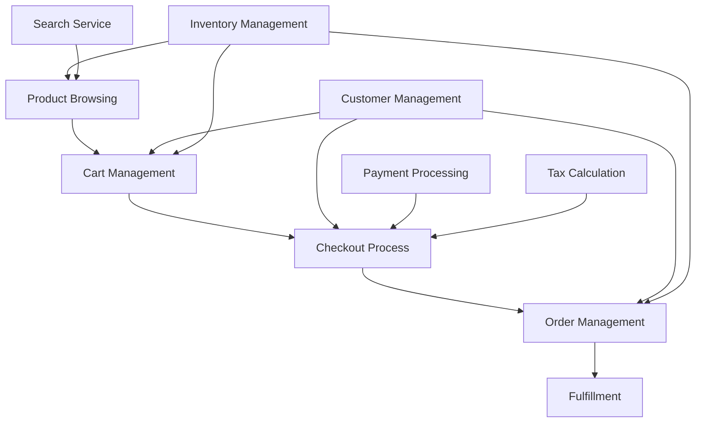

# E-commerce System Flow Framework Assessment

## Executive Summary

This assessment evaluates the current e-commerce system architecture through the lens of the Flow Framework, focusing on the four Flow Metrics (Velocity, Time, Efficiency, Load) and four Flow Items (Features, Defects, Risk, Debt). The analysis reveals a system with a solid foundation for supporting flow, but with several areas for improvement to optimize value stream delivery.

### Key Findings:

1. **Flow Velocity**: The system demonstrates good potential for measuring completion rates, but lacks comprehensive tracking across all flow items.
2. **Flow Time**: End-to-end value stream paths are identifiable, but there are potential bottlenecks in handoff points.
3. **Flow Efficiency**: The architecture supports some level of active vs. wait state tracking, but improvements in work visualization are needed.
4. **Flow Load**: WIP tracking capabilities exist but could be enhanced for better resource allocation visibility.

### Critical Recommendations:

1. Implement end-to-end flow item tracking across all services and integrations.
2. Enhance integration between order management and inventory systems to reduce wait times.
3. Develop a centralized dashboard for real-time visibility into all flow metrics.
4. Introduce automated quality gates and compliance checks in the deployment pipeline.

## Flow Metrics Analysis

### 1. Flow Velocity

Current Architectural Support: Moderate

- The system's modular architecture with clear capability separations allows for parallel development and deployment, potentially increasing velocity.
- Integration patterns, especially with services like Stripe and Shopify, provide APIs that can facilitate faster feature delivery.

Measurement Capabilities:
- Order management and cart systems can track transaction rates, providing partial velocity metrics.
- Lack of a centralized system for tracking all flow items (features, defects, risks, debt) limits comprehensive velocity measurement.

Identified Bottlenecks:
- Manual handoffs between product management and order fulfillment may slow down overall velocity.
- Potential delays in tax calculation and inventory updates could impact transaction speed.

Improvement Opportunities:
- Implement a unified tracking system for all flow items across the e-commerce platform.
- Automate handoffs between systems, especially for order processing and fulfillment.

Technical Recommendations:
- Integrate a workflow management tool that can track and measure the progress of all flow items.
- Implement event-driven architecture patterns to reduce coupling and increase responsiveness between services.

### 2. Flow Time

Current Architectural Support: Moderate

- The separation of concerns in the architecture (e.g., separate services for cart management, order management, and product management) allows for parallel processing, potentially reducing overall flow time.
- Integration with external services like Stripe for payments can help in reducing transaction times.

Measurement Capabilities:
- Order management system can track order lifecycle, providing partial flow time metrics.
- Lack of end-to-end tracking across all services limits comprehensive flow time measurement.

Identified Bottlenecks:
- Potential delays in inventory updates and tax calculations may increase flow time.
- Manual processes in customer support or order fulfillment could introduce significant wait times.

Improvement Opportunities:
- Implement distributed tracing across all services to get a complete picture of transaction flow times.
- Automate inventory updates and tax calculations to reduce processing times.

Technical Recommendations:
- Introduce a distributed tracing solution (e.g., Jaeger or Zipkin) to track requests across all services.
- Implement caching strategies for frequently accessed data (e.g., product information, tax rates) to reduce computation time.

### 3. Flow Efficiency

Current Architectural Support: Low to Moderate

- The modular architecture allows for independent scaling of services, which can contribute to improved efficiency.
- Integration with specialized services (e.g., Stripe for payments, Elastic Path for product management) leverages efficient, purpose-built solutions.

Measurement Capabilities:
- Limited visibility into active vs. wait states across the entire system.
- Lack of comprehensive work visualization tools identified.

Identified Bottlenecks:
- Potential inefficiencies in data synchronization between services (e.g., inventory, pricing, and order management).
- Manual processes in customer support or order management may introduce significant wait times.

Improvement Opportunities:
- Implement a system-wide monitoring and alerting solution to identify bottlenecks and inefficiencies.
- Develop a real-time dashboard for visualizing work states across all services.

Technical Recommendations:
- Integrate a monitoring solution like Prometheus with Grafana for visualizing system efficiency.
- Implement message queues (e.g., RabbitMQ, Apache Kafka) for asynchronous processing of non-critical operations to improve overall system responsiveness.

### 4. Flow Load

Current Architectural Support: Moderate

- The microservices architecture allows for independent scaling of components, which can help manage load.
- Integration with cloud providers (e.g., AWS, OCI) provides potential for elastic scaling.

Measurement Capabilities:
- Individual services likely have their own load metrics, but a unified view of system-wide WIP is not evident.
- Resource allocation visibility across the entire system appears limited.

Identified Bottlenecks:
- Potential for uneven load distribution across services during peak times.
- Lack of automated load balancing mechanisms identified in the current architecture.

Improvement Opportunities:
- Implement a centralized load monitoring and management system.
- Develop auto-scaling capabilities for all services to handle variable load.

Technical Recommendations:
- Implement a service mesh (e.g., Istio) for advanced traffic management and load balancing.
- Develop custom metrics for each service to track WIP and feed into a centralized monitoring system.

## Flow Items Analysis

### 1. Features (Business Value)

Tracking Capabilities:
- Product Management service provides a foundation for feature tracking.
- Integration with e-commerce platforms (e.g., Shopify, VTEX) allows for feature deployment.

Processing Efficiency:
- Modular architecture enables independent feature development and deployment.
- Lack of evident feature flag system may limit rapid experimentation.

Integration Effectiveness:
- Good integration between product management and inventory services facilitates feature rollout.
- Potential gap in connecting feature deployment with business metric tracking.

Measurement Systems:
- Order management and cart systems can provide some business metrics.
- Lack of comprehensive A/B testing infrastructure identified.

Improvement Recommendations:
- Implement a feature flag system for gradual rollouts and A/B testing.
- Develop a business metrics dashboard that correlates feature deployments with key performance indicators.

### 2. Defects (Quality)

Tracking Capabilities:
- No dedicated defect tracking system identified in the current architecture.
- Order management and customer support systems may provide partial defect information.

Processing Efficiency:
- Modular architecture allows for isolated testing and defect resolution.
- Lack of centralized defect management may lead to inefficiencies in resolution.

Integration Effectiveness:
- Integration between order management and customer support could facilitate defect identification.
- No clear integration for automated testing or continuous integration identified.

Measurement Systems:
- Limited visibility into quality metrics across the system.
- Lack of centralized incident management system identified.

Improvement Recommendations:
- Implement a dedicated defect tracking and management system.
- Integrate automated testing into the CI/CD pipeline for all services.
- Develop quality dashboards with key metrics like defect density, time to resolution, and customer impact.

### 3. Risk (Security/Compliance)

Tracking Capabilities:
- Integration with Stripe for payments provides some built-in security measures.
- Lack of dedicated security and compliance tracking systems identified.

Processing Efficiency:
- Modular architecture allows for isolated security updates and patches.
- No clear automated compliance checking mechanisms identified.

Integration Effectiveness:
- Payment integration with Stripe likely includes some security features.
- Lack of evident integration with security scanning or risk assessment tools.

Measurement Systems:
- Limited visibility into security metrics and compliance status.
- Absence of centralized risk management dashboard identified.

Improvement Recommendations:
- Implement regular automated security scans for all services.
- Develop a compliance checking system that integrates with the CI/CD pipeline.
- Create a risk management dashboard with key security and compliance metrics.

### 4. Debt (Technical)

Tracking Capabilities:
- No dedicated technical debt tracking system identified.
- Modular architecture may help in isolating and addressing technical debt.

Processing Efficiency:
- Independent services allow for targeted refactoring and updates.
- Lack of centralized debt tracking may lead to inconsistent prioritization.

Integration Effectiveness:
- No clear integration for code quality or technical debt measurement tools identified.
- Potential for inconsistent practices across different services and integrations.

Measurement Systems:
- Limited visibility into technical debt metrics across the system.
- Absence of centralized code quality and maintainability dashboards.

Improvement Recommendations:
- Implement code quality tools (e.g., SonarQube) and integrate them into the CI/CD pipeline.
- Develop a technical debt tracking system and prioritization process.
- Create dashboards for visualizing technical debt and code quality metrics across all services.

## Value Stream Architecture

### Integration Point Analysis

1. Product Browsing to Cart Management:
   - Potential bottleneck in real-time inventory updates.
   - Recommendation: Implement caching and event-driven updates for inventory status.

2. Cart Management to Checkout:
   - Critical path for customer conversion.
   - Recommendation: Optimize for performance and implement partial order processing.

3. Checkout to Order Management:
   - Crucial for order accuracy and customer satisfaction.
   - Recommendation: Implement transactional guarantees and idempotent operations.

4. Order Management to Fulfillment:
   - Potential for delays and errors in order processing.
   - Recommendation: Develop real-time tracking and automated exception handling.

### Handoff Optimization

1. Automate inventory updates between Product Management and Cart Management.
2. Implement asynchronous processing for non-critical operations (e.g., email notifications, analytics updates).
3. Develop a choreography-based event system for order status updates across services.

### Queue Management

1. Implement priority queues for critical operations (e.g., payment processing, order confirmation).
2. Develop back-pressure mechanisms to handle traffic spikes without system degradation.
3. Implement dead-letter queues and retry mechanisms for resilience in inter-service communication.

### Load Balancing Recommendations

1. Implement service mesh for advanced traffic management and load balancing.
2. Develop auto-scaling policies based on queue length and processing times.
3. Implement cache layers for frequently accessed data to reduce database load.

## Implementation Strategy

### Prioritized Improvements

1. End-to-end distributed tracing implementation
2. Centralized monitoring and alerting system
3. Feature flag system for gradual rollouts and A/B testing
4. Automated security scanning and compliance checking integration
5. Technical debt tracking and visualization system

### Quick Wins

1. Implement basic monitoring and alerting for critical paths
2. Introduce cache layers for product and inventory data
3. Develop initial dashboards for key flow metrics
4. Implement basic feature flagging for critical services

### Long-term Architectural Changes

1. Migrate to a fully event-driven architecture
2. Implement a comprehensive service mesh
3. Develop a machine learning-based predictive scaling system
4. Create a unified data lake for advanced analytics and reporting

### Dependencies and Prerequisites

1. Standardize logging and metrics collection across all services
2. Establish cross-functional teams aligned with value streams
3. Develop a comprehensive data model for flow items and metrics
4. Implement foundational DevOps practices across all teams

### Measurement Implementation Plan

1. Define key flow metrics and KPIs for each value stream
2. Implement basic telemetry in all services
3. Develop initial dashboards for flow metrics visualization
4. Establish regular flow efficiency reviews and improvement cycles
5. Implement advanced analytics for predictive flow management

## Risk and Impact Assessment

### Technical Risks

1. Increased system complexity with the introduction of new monitoring and tracing systems
2. Potential performance impact of comprehensive tracing and monitoring
3. Data consistency challenges in distributed event-driven systems
4. Security implications of increased observability and data collection

### Business Impact Analysis

1. Improved customer satisfaction through faster issue resolution and more reliable services
2. Increased development velocity leading to faster time-to-market for new features
3. Better resource allocation and cost management through improved visibility
4. Enhanced compliance and security posture, reducing risk of breaches and penalties

### Implementation Complexity

1. Distributed tracing implementation: High
2. Centralized monitoring system: Medium
3. Feature flag system: Medium
4. Automated security and compliance checks: High
5. Technical debt tracking system: Medium

### Resource Requirements

1. DevOps engineers for implementing monitoring and tracing systems
2. Software architects for designing event-driven systems and service mesh
3. Security specialists for implementing automated security scans and compliance checks
4. Data engineers for developing the data lake and analytics capabilities
5. Full-stack developers for creating dashboards and visualization tools

### Change Management Considerations

1. Training programs for all development teams on new tools and practices
2. Gradual rollout of new systems to minimize disruption
3. Regular communication and updates to all stakeholders
4. Establishment of centers of excellence for key areas (e.g., observability, security)
5. Development of new KPIs and performance evaluation criteria aligned with flow metrics

By implementing these recommendations and focusing on continuous improvement of flow metrics, the e-commerce system can significantly enhance its ability to deliver value quickly, efficiently, and reliably to its customers.