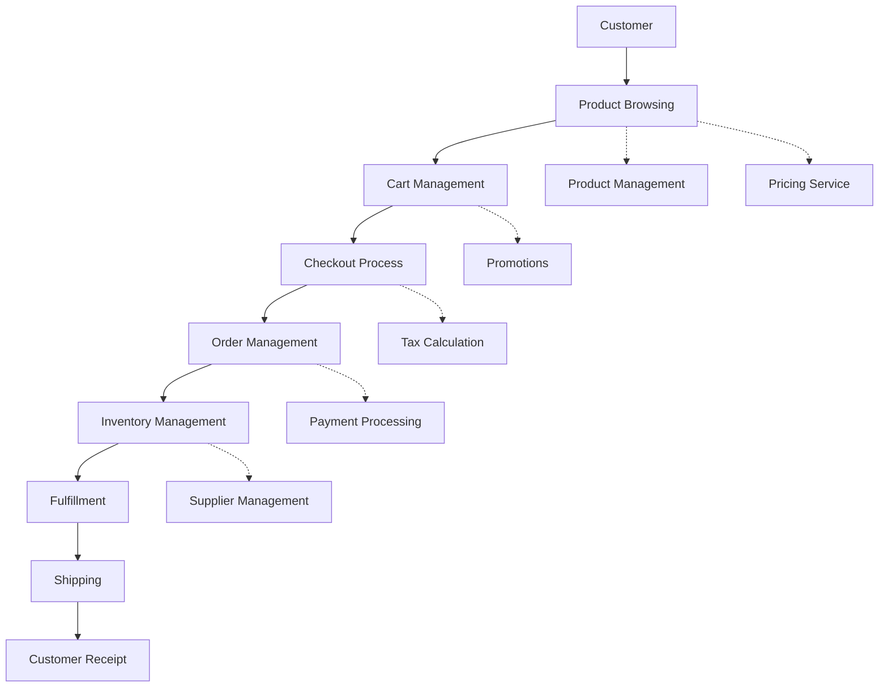

# Flow Framework Efficiency Assessment

## Executive Summary

This assessment evaluates the current e-commerce system architecture through the lens of the Flow Framework, with a specific focus on efficiency. The analysis reveals a system with strong foundations for supporting efficient workflows, but also identifies several areas for improvement to optimize the value stream.

### Key Findings:

1. The microservices architecture provides a good base for flow efficiency, allowing for independent scaling and deployment of services.
2. Integration of various capabilities (e.g., caching, logging, rate limiting) supports overall system efficiency.
3. Opportunities exist to enhance flow measurement and visualization across the value stream.
4. Some potential bottlenecks in data flow and inter-service communication could impact overall efficiency.

### Critical Recommendations:

1. Implement comprehensive tracing and monitoring across all services to provide end-to-end visibility of flow items.
2. Enhance the caching strategy to reduce redundant operations and improve response times.
3. Optimize inter-service communication patterns to reduce latency and improve overall system efficiency.
4. Introduce automated load balancing and scaling mechanisms to better handle varying workloads.

## Flow Metrics Analysis

### 1. Flow Efficiency

Current Architectural Support:
- The microservices architecture allows for independent optimization of each service.
- Caching capabilities are in place, potentially reducing wait times for frequently accessed data.
- Rate limiting helps prevent system overload, maintaining consistent performance.

Measurement Capabilities:
- Request tracing aspect provides a foundation for measuring end-to-end request times.
- Logging service enables capturing of important events and timings.

Identified Bottlenecks:
- Potential overuse of synchronous communication between services may introduce unnecessary wait times.
- Lack of clear visibility into queue depths and processing times across services.

Improvement Opportunities:
- Implement more granular tracing to identify specific wait states within and between services.
- Enhance caching strategies to further reduce wait times for data retrieval.
- Introduce asynchronous processing where appropriate to improve overall flow efficiency.

Technical Recommendations:
- Extend the request tracing aspect to capture more detailed timing information, including queue wait times and processing times for each service.
- Implement a distributed caching layer to reduce database load and improve response times for frequently accessed data.
- Introduce message queues for appropriate workflows to decouple services and enable asynchronous processing.

### 2. Flow Time

Current Architectural Support:
- Microservices architecture allows for parallel processing of different aspects of an order or customer interaction.
- Integration of various services (e.g., inventory, pricing, tax calculation) enables quick access to necessary data.

Measurement Capabilities:
- Request tracing provides a basis for measuring end-to-end transaction times.
- Order management capability likely tracks order processing times.

Identified Bottlenecks:
- Potential for increased latency due to multiple service calls for a single user transaction.
- Possible delays in inventory updates or pricing calculations affecting overall flow time.

Improvement Opportunities:
- Optimize critical path operations to reduce overall transaction times.
- Implement predictive scaling to handle peak loads more efficiently.

Technical Recommendations:
- Conduct a thorough analysis of service dependencies and optimize the critical path for key user journeys.
- Implement circuit breakers and fallback mechanisms to prevent cascading failures and maintain flow during partial outages.
- Enhance the monitoring system to provide real-time visibility into service performance and flow times.

### 3. Flow Velocity

Current Architectural Support:
- Modular architecture allows for independent deployment and scaling of services.
- Integration with various e-commerce platforms (e.g., Shopify, VTEX) enables multi-channel support.

Measurement Capabilities:
- Order management and inventory services likely provide data on throughput.
- Logging service can be utilized to track completion rates of various operations.

Identified Bottlenecks:
- Potential limitations in processing capacity during high-load periods.
- Possible constraints in third-party integrations affecting overall system velocity.

Improvement Opportunities:
- Implement auto-scaling mechanisms to handle varying loads more effectively.
- Optimize database operations and queries to improve overall system throughput.

Technical Recommendations:
- Implement a robust auto-scaling solution that can proactively adjust resource allocation based on predicted demand.
- Conduct a performance audit of database operations and implement optimizations such as query caching and read replicas where appropriate.
- Enhance monitoring to provide real-time visibility into system throughput and completion rates across all services.

### 4. Flow Load

Current Architectural Support:
- Microservices architecture allows for independent scaling of services based on load.
- Rate limiting helps prevent individual services from becoming overwhelmed.

Measurement Capabilities:
- Logging service can be utilized to track active requests and queue depths.
- Inventory and order management services likely provide insights into current workload.

Identified Bottlenecks:
- Potential for uneven load distribution across services during peak times.
- Possible resource contention in shared services (e.g., caching, database).

Improvement Opportunities:
- Implement more sophisticated load balancing strategies.
- Enhance resource allocation mechanisms to better handle varying workloads.

Technical Recommendations:
- Implement advanced load balancing that takes into account service health, current load, and predictive analytics.
- Develop a comprehensive monitoring dashboard that provides real-time visibility into the load across all services and components.
- Implement dynamic resource allocation mechanisms that can automatically adjust based on current and predicted load patterns.

## Flow Items Analysis

### 1. Features (Business Value)

Tracking Capabilities:
- Product management and inventory services provide a foundation for tracking new features and product offerings.
- Survey management capability enables gathering customer feedback on features.

Processing Efficiency:
- Microservices architecture allows for rapid deployment of new features across specific services.
- Integration with multiple e-commerce platforms enables quick rollout across different channels.

Integration Effectiveness:
- Good integration between product management, inventory, and order processing systems.
- Potential for improved integration with customer segmentation for targeted feature rollouts.

Measurement Systems:
- Survey management and customer segmentation capabilities provide means to measure feature impact.
- Logging and analytics services can be utilized to track feature usage and performance.

Improvement Recommendations:
- Implement a feature flag system to enable controlled rollout and A/B testing of new features.
- Enhance integration between customer segmentation and product management to enable more targeted feature deployments.
- Develop a comprehensive analytics pipeline to measure the business impact of new features more effectively.

### 2. Defects (Quality)

Tracking Capabilities:
- Logging service provides a foundation for error tracking and analysis.
- Order management and inventory services likely include mechanisms for identifying discrepancies.

Processing Efficiency:
- Microservices architecture allows for isolated testing and rapid deployment of fixes.
- Caching and rate limiting capabilities help maintain system stability, potentially reducing certain types of defects.

Integration Effectiveness:
- Good integration of logging across services enables centralized defect tracking.
- Potential for improved integration of automated testing and quality assurance processes.

Measurement Systems:
- Logging service can be utilized to track error rates and types.
- Order management system likely provides data on order accuracy and fulfillment issues.

Improvement Recommendations:
- Implement a comprehensive, centralized error tracking and analysis system.
- Enhance automated testing processes, including integration and end-to-end tests.
- Develop real-time quality dashboards to provide visibility into defect rates and trends across all services.

### 3. Risk (Security/Compliance)

Tracking Capabilities:
- Rate limiting and request tracing aspects provide some level of security control and audit capability.
- Tax calculation service indicates attention to compliance requirements.

Processing Efficiency:
- Microservices architecture allows for isolated updates to address security issues.
- Centralized authentication and authorization likely improve security management efficiency.

Integration Effectiveness:
- Good integration of rate limiting and request tracing across services.
- Potential for improved integration of comprehensive security scanning and compliance checking.

Measurement Systems:
- Logging service can be utilized for security event tracking and auditing.
- Request tracing provides a foundation for identifying unusual patterns or potential security issues.

Improvement Recommendations:
- Implement a comprehensive security information and event management (SIEM) system.
- Enhance compliance checking capabilities, particularly for data privacy regulations.
- Develop automated security scanning and vulnerability assessment processes integrated into the CI/CD pipeline.

### 4. Debt (Technical)

Tracking Capabilities:
- Version control and deployment systems likely provide some insight into codebase state.
- Logging and monitoring systems can indicate performance issues that may signal technical debt.

Processing Efficiency:
- Microservices architecture allows for gradual refactoring and modernization of individual services.
- Caching and other optimization techniques help mitigate performance impact of some technical debt.

Integration Effectiveness:
- Good separation of concerns in the microservices architecture facilitates manageable technical debt.
- Potential for improved tracking and prioritization of technical debt across services.

Measurement Systems:
- Logging and monitoring systems can provide indicators of technical debt impact.
- Code quality and test coverage metrics likely available from development tools.

Improvement Recommendations:
- Implement a systematic approach to identifying and tracking technical debt across all services.
- Develop clear metrics for measuring the impact of technical debt on system performance and development velocity.
- Establish regular "innovation sprints" or "debt repayment sprints" to address high-priority technical debt items.

## Value Stream Architecture

### End-to-end Flow Visualization

### Integration Point Analysis

1. Product Browsing to Cart Management: Efficient, supported by caching and product management integration.
2. Cart Management to Checkout: Potential for optimization in tax and promotion calculations.
3. Checkout to Order Management: Critical path, requires robust error handling and transaction management.
4. Order Management to Inventory Management: Potential for race conditions, needs careful synchronization.
5. Inventory Management to Fulfillment: Opportunity for predictive analytics to improve efficiency.

### Handoff Optimization

1. Implement asynchronous communication patterns for non-critical path operations.
2. Enhance data consistency mechanisms between services, particularly for inventory and order data.
3. Implement retry mechanisms with exponential backoff for improved resilience during service communication failures.

### Queue Management

1. Implement a distributed queue system for managing workloads across services.
2. Develop real-time monitoring of queue depths and processing times.
3. Implement dynamic scaling based on queue metrics to maintain optimal processing efficiency.

### Load Balancing Recommendations

1. Implement advanced load balancing that considers service health and current load.
2. Develop predictive scaling mechanisms based on historical data and upcoming events (e.g., sales promotions).
3. Implement circuit breakers to prevent cascading failures and maintain partial system functionality during issues.

## Implementation Strategy

### Prioritized Improvements

1. Enhance end-to-end tracing and monitoring across all services.
2. Implement a distributed caching layer to improve response times and reduce database load.
3. Develop a comprehensive, real-time system health and performance dashboard.
4. Implement asynchronous processing for appropriate workflows to improve overall system efficiency.
5. Enhance automated testing and quality assurance processes.

### Quick Wins

1. Optimize database queries and implement query result caching where appropriate.
2. Implement basic circuit breakers for critical service-to-service communications.
3. Enhance logging to capture more detailed timing and error information across services.

### Long-term Architectural Changes

1. Transition to a fully event-driven architecture for improved decoupling and scalability.
2. Implement a service mesh for advanced traffic management, security, and observability.
3. Develop a comprehensive data lake and analytics pipeline for improved business intelligence and system optimization.

### Dependencies and Prerequisites

1. Establish a cross-functional team to oversee flow optimization initiatives.
2. Ensure all services have consistent logging and metric emission capabilities.
3. Implement a centralized configuration management system to facilitate coordinated changes across services.

### Measurement Implementation Plan

1. Define key performance indicators (KPIs) for each flow metric and flow item type.
2. Implement real-time dashboards for visualizing flow metrics across the entire system.
3. Establish regular review processes to analyze flow data and identify improvement opportunities.
4. Implement A/B testing capabilities to measure the impact of flow optimization initiatives.

## Risk and Impact Assessment

### Technical Risks

1. Potential for increased system complexity with the introduction of new monitoring and optimization tools.
2. Risk of performance degradation during the implementation of new tracing and monitoring capabilities.
3. Potential for data inconsistencies during the transition to more asynchronous processing patterns.

### Business Impact Analysis

1. Improved system efficiency is expected to lead to higher customer satisfaction and increased sales.
2. Enhanced monitoring and optimization capabilities will enable more data-driven decision making.
3. Improved system reliability and performance may provide a competitive advantage in the e-commerce market.

### Implementation Complexity

1. Enhancing end-to-end tracing: Medium complexity, requires coordination across all services.
2. Implementing distributed caching: Medium to high complexity, requires careful planning to ensure data consistency.
3. Transitioning to event-driven architecture: High complexity, requires significant refactoring of existing services.

### Resource Requirements

1. Dedicated DevOps team for implementing and managing new monitoring and optimization tools.
2. Training for development teams on new architectural patterns and best practices.
3. Potential need for additional infrastructure to support enhanced monitoring and data analytics capabilities.

### Change Management Considerations

1. Establish clear communication channels to keep all stakeholders informed of changes and their impacts.
2. Provide comprehensive training on new tools and processes to all relevant team members.
3. Implement gradual rollout of changes with close monitoring to minimize disruption to ongoing operations.
4. Establish feedback mechanisms to quickly identify and address any issues arising from the changes.

By focusing on these flow efficiency improvements, the e-commerce system can significantly enhance its ability to deliver value quickly and reliably, ultimately leading to improved customer satisfaction and business outcomes.