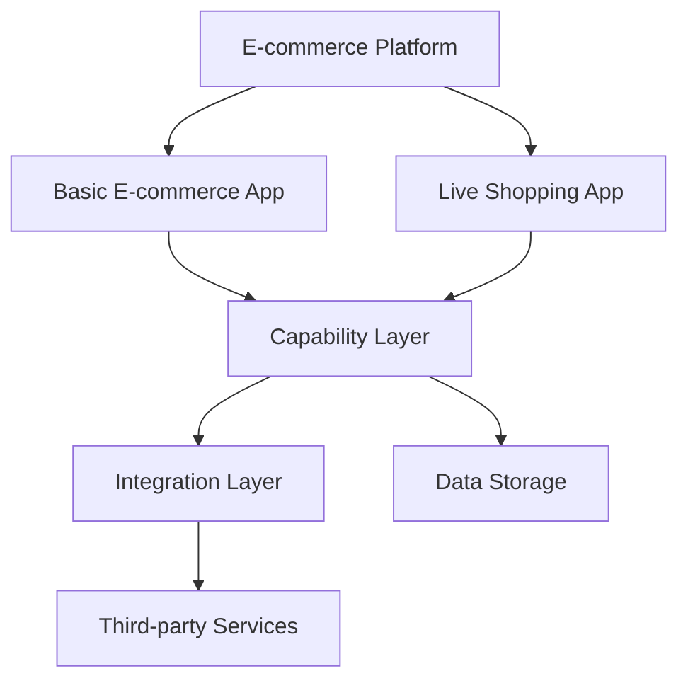
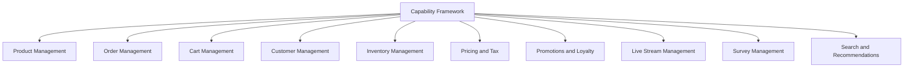
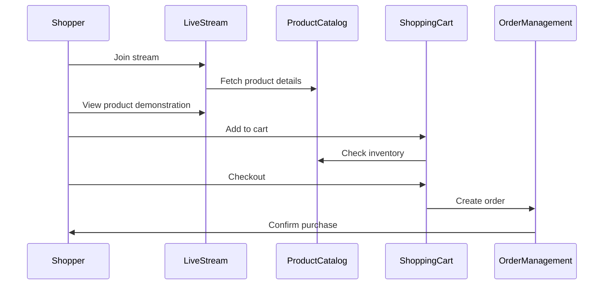
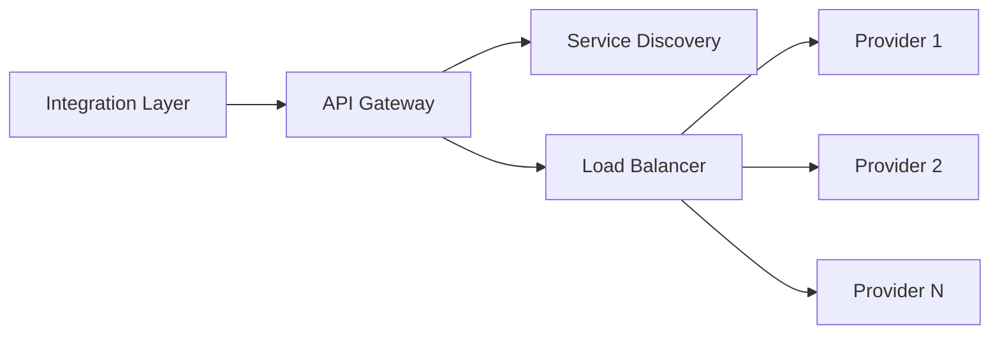
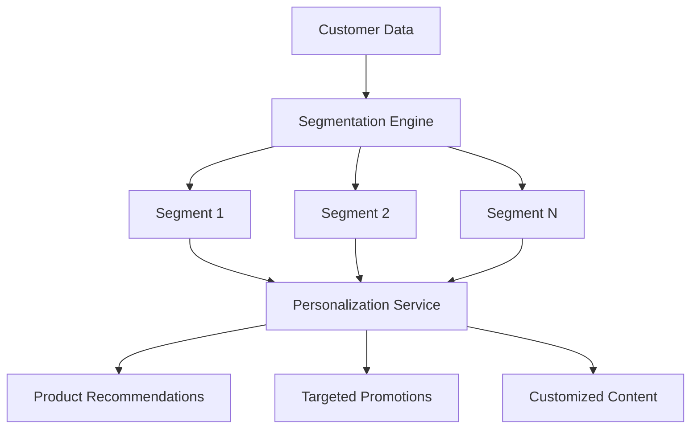

**FIELD OF THE INVENTION**

[0001] The present invention relates to the field of e-commerce systems and applications. More specifically, it pertains to a comprehensive, modular, and extensible e-commerce platform that integrates live shopping experiences with traditional online retail functionalities.

**BACKGROUND OF THE INVENTION**

**Technical Background**

[0002] E-commerce has revolutionized the retail industry, enabling businesses to reach global markets and providing consumers with unprecedented convenience. Traditional e-commerce platforms typically offer features such as product browsing, shopping cart management, and secure checkout processes. However, as consumer expectations evolve and technology advances, there is a growing need for more engaging and interactive shopping experiences.

[0003] Challenges in Existing Systems

1. Limited Interactivity - Most e-commerce platforms lack real-time interaction between sellers and buyers, resulting in a less engaging shopping experience.

2. Integration Complexity - Existing systems often struggle to seamlessly integrate various components such as inventory management, order processing, and customer relationship management.

3. Scalability Issues - Many e-commerce solutions face challenges in scaling to accommodate growing product catalogs, user bases, and transaction volumes.

4. Personalization Limitations - Current platforms often provide limited capabilities for tailoring the shopping experience to individual user preferences and behaviors.

[0004] The need for a solution that addresses these challenges is evident. A comprehensive e-commerce system that combines traditional online shopping functionality with interactive, real-time features could revolutionize the digital retail landscape. Such a solution would:

* Enable retailers to showcase products through live demonstrations, fostering a more engaging and persuasive sales environment.

* Provide a modular architecture that allows for seamless integration of various e-commerce components and third-party services.

* Offer scalable infrastructure to handle growing business needs and peak shopping periods.

* Leverage advanced data analytics and customer segmentation to deliver personalized shopping experiences.

By addressing these challenges, the proposed system aims to bridge the gap between traditional e-commerce and the evolving expectations of modern consumers and retailers.

**SUMMARY OF THE INVENTION**

[0005] The disclosed invention provides a comprehensive e-commerce platform that integrates traditional online shopping functionalities with interactive live shopping experiences. Key aspects of the invention include:

1. Dual Application Architecture
   * A basic e-commerce application for traditional online shopping
   * A live shopping application for real-time product demonstrations and purchases

2. Modular Capability Framework
   * Product Management
   * Order Management
   * Cart Management
   * Customer Management
   * Inventory Management
   * Pricing and Tax Calculation
   * Promotions and Loyalty Programs
   * Live Stream Management
   * Survey Management
   * Search and Recommendation Services

3. Integration Layer
   * Supports multiple third-party service providers
   * Enables seamless communication between capabilities and external services

4. Advanced Features
   * Real-time inventory updates
   * Dynamic pricing
   * Personalized product recommendations
   * Interactive live streams with real-time purchasing
   * Customer segmentation and targeted marketing

5. Scalable Infrastructure
   * Utilizes cloud services for elasticity
   * Implements caching mechanisms for improved performance

This innovative system combines the best aspects of traditional e-commerce with cutting-edge interactive features, providing a flexible and powerful platform for modern retail businesses.

**BRIEF DESCRIPTION OF THE DRAWINGS**

* **FIG. 1**: High-level architecture of the e-commerce platform

* **FIG. 2**: Capability framework overview

* **FIG. 3**: Live shopping application workflow

* **FIG. 4**: Integration layer architecture

* **FIG. 5**: Customer segmentation and personalization flow

**DETAILED DESCRIPTION OF THE INVENTION**

1. System Overview

The invention comprises a comprehensive e-commerce platform that integrates traditional online shopping functionalities with interactive live shopping experiences. The system is built on a modular architecture, allowing for flexibility and scalability. Key components include:

* Web Applications: Two primary user interfaces - a basic e-commerce application for traditional online shopping, and a live shopping application for real-time product demonstrations and purchases.

* Capability Layer: A set of core e-commerce functionalities implemented as modular services, including product management, order management, cart management, customer management, inventory management, pricing and tax calculation, promotions and loyalty programs, live stream management, survey management, and search and recommendation services.

* Integration Layer: A flexible middleware that enables seamless communication between the platform's capabilities and various third-party services and providers.

* Data Storage: A distributed database system that stores product information, customer data, order history, and other relevant information.

* Caching Layer: An in-memory data store that improves system performance by caching frequently accessed data.

* Message Queue: A robust messaging system that facilitates asynchronous communication between different components of the platform.

2. Key Features & Workflows

A. Live Shopping Experience

1. User Interaction: Shoppers can join live streams hosted by retailers, view real-time product demonstrations, ask questions through comments, and react to the stream content.

2. Real-time Purchase: During a live stream, viewers can add showcased products to their cart and complete purchases without leaving the stream.

3. Stream Management: Retailers can create, schedule, and manage live streams, including adding products to be showcased and monitoring viewer engagement.

B. Advanced Product Discovery

1. Intelligent Search: Utilizes natural language processing and machine learning algorithms to provide relevant search results based on user queries and behavior.

2. Personalized Recommendations: Analyzes user browsing history, purchase patterns, and demographic information to suggest relevant products.

3. Dynamic Categorization: Automatically organizes products into categories and subcategories based on their attributes and customer interaction data.

C. Omnichannel Order Management

1. Order Creation: Supports order placement through multiple channels, including the web interface, mobile app, and live streams.

2. Fulfillment Optimization: Intelligently routes orders to the most appropriate fulfillment center based on inventory levels, shipping costs, and delivery time estimates.

3. Real-time Tracking: Provides customers with up-to-date information on their order status and estimated delivery times.

D. Customer Segmentation and Personalization

1. Data Collection: Gathers customer data from various touchpoints, including browsing behavior, purchase history, and interaction with live streams.

2. Segmentation Engine: Utilizes machine learning algorithms to group customers into meaningful segments based on their characteristics and behaviors.

3. Personalized Marketing: Delivers targeted promotions, product recommendations, and content based on customer segment and individual preferences.

E. Dynamic Pricing and Promotions

1. Real-time Price Adjustments: Automatically updates product prices based on factors such as demand, competitor pricing, and inventory levels.

2. Customized Promotions: Creates and applies personalized discounts and offers based on customer segments and individual purchase history.

3. Loyalty Program Integration: Seamlessly integrates with the platform's loyalty program, allowing customers to earn and redeem points across all shopping experiences.

**CLAIMS**

1. A comprehensive e-commerce system comprising:
   * A basic e-commerce web application for traditional online shopping;
   * A live shopping application enabling real-time product demonstrations and purchases;
   * A modular capability layer providing core e-commerce functionalities;
   * An integration layer facilitating communication between system capabilities and third-party services;
   * A distributed database for storing product, customer, and order information;
   * An in-memory cache for improving system performance;
   * A message queue for facilitating asynchronous communication between system components.

2. The system of claim 1, wherein the modular capability layer includes:
   * Product management;
   * Order management;
   * Cart management;
   * Customer management;
   * Inventory management;
   * Pricing and tax calculation;
   * Promotions and loyalty programs;
   * Live stream management;
   * Survey management;
   * Search and recommendation services.

3. The system of claim 1, wherein the live shopping application enables:
   * Real-time video streaming of product demonstrations;
   * Interactive viewer comments and reactions;
   * In-stream product purchases without leaving the live video interface.

4. A method for providing personalized e-commerce experiences, comprising:
   * Collecting customer data from multiple touchpoints;
   * Segmenting customers using machine learning algorithms;
   * Generating personalized product recommendations based on customer segments and individual behaviors;
   * Delivering targeted promotions and content to customers across different shopping channels.

5. The method of claim 4, further comprising:
   * Dynamically adjusting product prices based on real-time market conditions and customer segments;
   * Applying personalized discounts and offers during the checkout process.

6. A method for managing omnichannel e-commerce orders, comprising:
   * Receiving orders through multiple channels including web, mobile, and live stream interfaces;
   * Optimizing order fulfillment by selecting the most appropriate fulfillment center based on inventory levels, shipping costs, and delivery time estimates;
   * Providing real-time order tracking and status updates to customers.

**NOVEL ASPECTS & ADVANTAGES**

✅ **Integrated Live Shopping Experience** – Combines traditional e-commerce with interactive, real-time product demonstrations, enabling a more engaging and persuasive sales environment.

✅ **Modular and Extensible Architecture** – Allows for easy integration of new capabilities and third-party services, ensuring the platform can adapt to evolving business needs and technological advancements.

✅ **Advanced Customer Segmentation and Personalization** – Utilizes machine learning to deliver highly targeted and personalized shopping experiences, increasing customer engagement and sales conversion rates.

✅ **Real-time Dynamic Pricing and Inventory Management** – Enables businesses to optimize pricing strategies and manage inventory more effectively, improving profitability and reducing stockouts.

✅ **Omnichannel Order Management** – Provides a seamless shopping experience across multiple channels, with intelligent order routing and real-time tracking capabilities.

**CONCLUSION**

The disclosed e-commerce platform represents a significant advancement in online retail technology. By integrating live shopping experiences with traditional e-commerce functionalities, and leveraging advanced data analytics and machine learning, the system provides a more engaging, personalized, and efficient shopping experience for consumers. For retailers, the platform offers powerful tools for showcasing products, managing inventory, and optimizing sales strategies. The modular and extensible architecture ensures that the platform can evolve with changing market demands and technological innovations, making it a future-proof solution for the rapidly changing world of e-commerce.