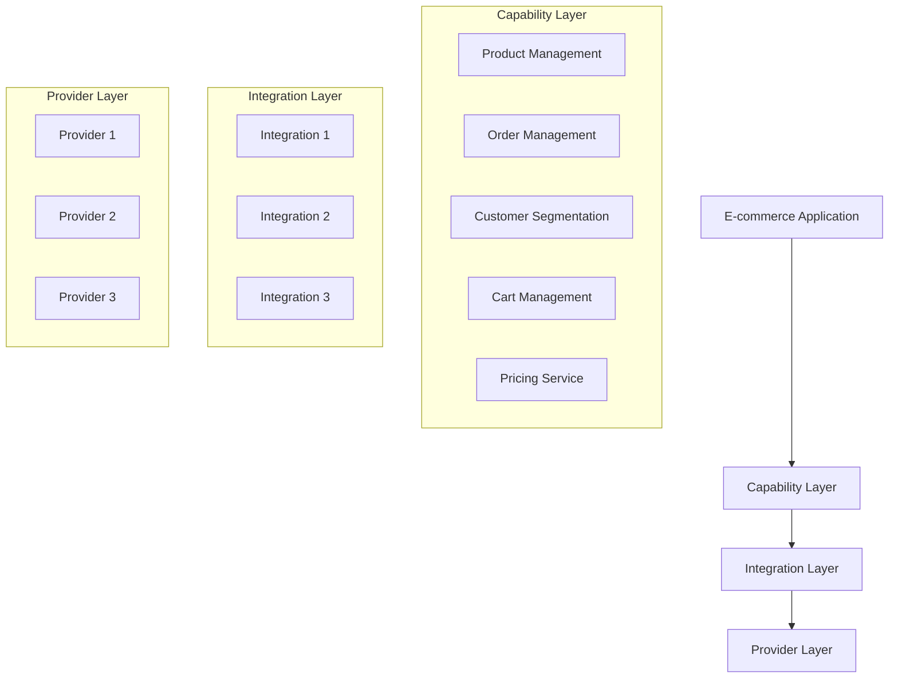
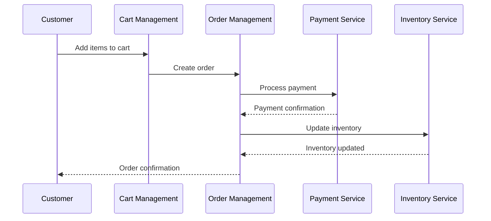
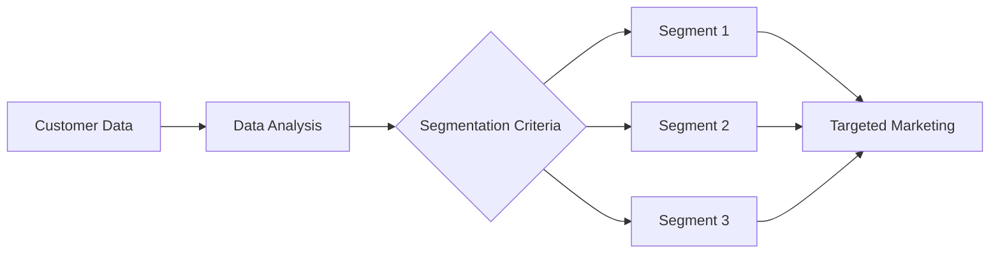
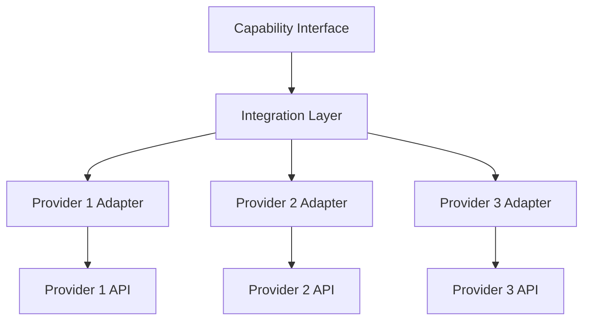
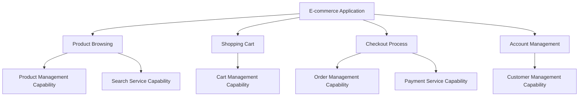

**FIELD OF THE INVENTION**

[0001] The present invention relates to the field of e-commerce systems and applications. Specifically, it describes a modular and extensible e-commerce platform that integrates various capabilities such as product management, order processing, customer segmentation, and pricing services to provide a comprehensive solution for online retail businesses.

**BACKGROUND OF THE INVENTION**

**Technical Background**

[0002] E-commerce has become an integral part of modern business, allowing companies to reach global markets and provide convenient shopping experiences to customers. The technical infrastructure supporting e-commerce operations has evolved to include complex systems that manage product catalogs, process orders, handle payments, and analyze customer behavior.

[0003] Challenges in Existing Systems

1. Integration Complexity - Existing e-commerce systems often struggle with integrating multiple services and providers, leading to data silos and inefficient operations.

2. Scalability Issues - As businesses grow, their e-commerce platforms need to scale accordingly, which can be challenging with monolithic architectures.

3. Customization Limitations - Many e-commerce solutions offer limited customization options, making it difficult for businesses to adapt the platform to their unique needs.

4. Performance Bottlenecks - High traffic volumes during peak shopping periods can strain system resources, leading to slow response times and poor user experiences.

[0004] The need for a solution that addresses these challenges is evident. Current solutions often lack the flexibility and modularity required to create truly adaptable e-commerce ecosystems. This invention provides a novel approach by:

* Enabling seamless integration of various e-commerce capabilities through a modular architecture
* Allowing businesses to scale individual components as needed
* Providing extensive customization options through capability integrations and provider connections
* Optimizing performance through distributed processing and efficient data management

The system addresses the challenges by introducing a capability-driven architecture that separates concerns and allows for easy extension and modification of e-commerce functionalities.

**SUMMARY OF THE INVENTION**

[0005] The disclosed invention provides a comprehensive e-commerce application system that revolutionizes online retail operations through its modular and extensible design. Key aspects of the invention include:

1. Capability-Based Architecture: The system is built around distinct capabilities such as product management, order processing, and customer segmentation, each encapsulating specific e-commerce functionalities.

2. Integration Framework: A robust integration layer allows seamless connection between capabilities and various third-party providers, enabling businesses to leverage best-of-breed solutions.

3. Extensible Platform:
   * New capabilities can be easily added to extend system functionality
   * Existing capabilities can be customized or replaced without affecting the entire system
   * Multiple provider options for each capability allow for flexible implementation choices

4. Unified Data Model: A consistent data model across capabilities ensures smooth data flow and coherent operations throughout the e-commerce ecosystem.

5. Application Layer: Pre-built applications leveraging the underlying capabilities provide ready-to-use e-commerce solutions that can be further customized to meet specific business needs.

The invention provides a flexible, scalable, and performant e-commerce platform that can adapt to changing business requirements and technological advancements in the online retail space.

**BRIEF DESCRIPTION OF THE DRAWINGS**

* **FIG. 1**: High-level architecture of the e-commerce application system

* **FIG. 2**: Data flow diagram for order processing

* **FIG. 3**: Customer segmentation process

* **FIG. 4**: Integration framework for capability providers

* **FIG. 5**: Application composition using capabilities

**DETAILED DESCRIPTION OF THE INVENTION**

1. System Overview

The e-commerce application system is designed as a modular, capability-driven platform that provides a comprehensive solution for online retail operations. The system comprises several key components:

* Application Layer: Implements user-facing e-commerce functionalities by leveraging underlying capabilities.
* Capability Layer: Encapsulates core e-commerce functionalities as independent, reusable modules.
* Integration Layer: Facilitates communication between capabilities and external service providers.
* Provider Layer: Represents various third-party services and APIs that can be integrated into the system.
* Data Storage: A distributed database system that maintains consistent data across capabilities.
* Event Processing: A message queue system for handling asynchronous operations and maintaining system responsiveness.

2. Key Features & Workflows

A. Product Management

1. User Interaction: Merchants can create, update, and manage product information through a user-friendly interface.
2. Data Storage: Product data is stored in a structured format, allowing for efficient querying and retrieval.
3. Event Processing: Updates to product information trigger events that propagate changes to related systems (e.g., search index updates).

B. Order Management

1. Order Creation: The system creates orders based on customer cart data and payment information.
2. Order Processing: Orders go through various stages (e.g., payment processing, fulfillment, shipping) managed by the order management capability.
3. Integration: The order management capability integrates with external systems for payment processing, inventory management, and shipping services.

C. Customer Segmentation

1. Data Collection: Customer behavior and transaction data are collected across various touchpoints.
2. Analysis: The system applies predefined or custom segmentation criteria to categorize customers.
3. Application: Segmentation data is used to personalize marketing efforts, product recommendations, and user experiences.

D. Cart Management

1. Session Handling: The system maintains cart data across user sessions, allowing for a seamless shopping experience.
2. Real-time Updates: Cart totals and availability are updated in real-time as items are added or removed.
3. Integration: The cart management capability integrates with product management for pricing and inventory information.

E. Pricing Service

1. Dynamic Pricing: The system supports real-time price adjustments based on various factors (e.g., demand, inventory levels).
2. Promotion Management: Merchants can create and apply promotional rules that affect product pricing.
3. Multi-currency Support: Prices can be displayed and calculated in multiple currencies based on user preferences or location.

**CLAIMS**

1. An e-commerce application system comprising:
   * A capability layer implementing modular e-commerce functionalities
   * An integration layer facilitating communication between capabilities and external providers
   * A provider layer representing third-party services and APIs
   * A data storage system maintaining consistent data across capabilities
   * An event processing system for handling asynchronous operations

2. The system of claim 1, wherein the capability layer includes modules for:
   * Product management
   * Order management
   * Customer segmentation
   * Cart management
   * Pricing services

3. The system of claim 1, wherein the integration layer allows for:
   * Dynamic selection of service providers for each capability
   * Seamless switching between different providers without affecting the overall system functionality

4. A method for processing e-commerce transactions, comprising:
   * Receiving a purchase request through a cart management capability
   * Creating an order using an order management capability
   * Processing payment through an integrated payment service provider
   * Updating inventory using a product management capability
   * Sending order confirmation to the customer

5. The method of claim 4, further comprising:
   * Analyzing the transaction data using a customer segmentation capability
   * Updating customer segments based on the transaction
   * Applying personalized promotions or recommendations for future interactions

6. A system for dynamic pricing in e-commerce, comprising:
   * A pricing service capability that determines real-time prices based on configurable rules
   * Integration with inventory management to adjust prices based on stock levels
   * Support for multi-currency pricing and automatic currency conversion

**NOVEL ASPECTS & ADVANTAGES**

✅ **Modular Capability Architecture** – Allows for unprecedented flexibility in composing e-commerce solutions and easily extending functionality as business needs evolve.

✅ **Provider-Agnostic Integration** – Enables businesses to leverage best-of-breed solutions for each capability without being locked into a single vendor ecosystem.

✅ **Extensible Application Layer** – Provides pre-built e-commerce applications that can be easily customized and extended using the underlying capabilities.

✅ **Unified Data Model** – Ensures consistency across all e-commerce operations and facilitates seamless data flow between different system components.

✅ **Event-Driven Design** – Improves system responsiveness and scalability by leveraging asynchronous processing for complex operations.

**CONCLUSION**

The invented e-commerce application system represents a significant advancement in the field of online retail technology. By introducing a modular, capability-driven architecture, the system addresses key challenges faced by modern e-commerce businesses, including integration complexity, scalability limitations, and customization restrictions.

The novel approach of separating core e-commerce functionalities into distinct capabilities, coupled with a flexible integration framework, allows businesses to create tailored solutions that can easily adapt to changing market demands and technological advancements. The system's extensibility ensures that it can evolve alongside the rapidly changing e-commerce landscape, providing a future-proof platform for online retail operations.

Furthermore, the unified data model and event-driven design contribute to improved performance and data consistency across the entire e-commerce ecosystem. This holistic approach to e-commerce system design sets a new standard for flexibility, scalability, and efficiency in online retail platforms.

In conclusion, this invention provides a comprehensive solution to the challenges faced by modern e-commerce businesses, offering a powerful tool for creating robust, scalable, and adaptable online retail experiences.