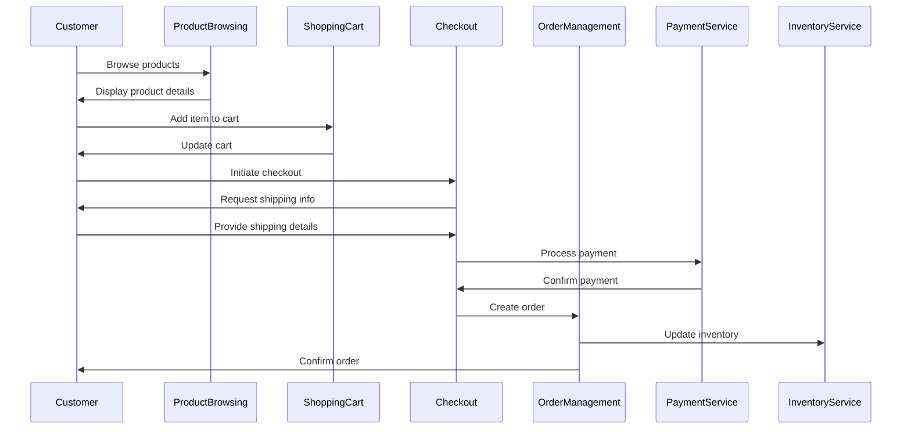

# Provisional Patent Application

## FIELD OF THE INVENTION

The present invention relates to the field of electronic commerce (e-commerce) systems and applications. More specifically, it pertains to an integrated suite of e-commerce applications and capabilities that provide a comprehensive solution for online retail operations, including product management, order processing, customer relationship management, and various other aspects of digital commerce.

## BACKGROUND OF THE INVENTION

E-commerce has revolutionized the way businesses operate and consumers shop. With the exponential growth of internet usage and digital technologies, online shopping has become an integral part of the global retail landscape. However, many existing e-commerce solutions are fragmented, requiring businesses to piece together multiple disparate systems to create a functional online store. This approach often leads to integration challenges, data inconsistencies, and a suboptimal user experience for both merchants and customers.

Current e-commerce platforms typically offer basic functionalities such as product catalogs, shopping carts, and payment processing. However, they often lack advanced features like sophisticated customer segmentation, dynamic pricing, or seamless integration with various third-party services. Additionally, many solutions are not easily scalable or adaptable to specific business needs, limiting their effectiveness as companies grow or pivot their strategies.

There is a clear need for a more comprehensive, flexible, and integrated e-commerce solution that can address the complex needs of modern online retailers while providing a seamless experience for consumers.

## SUMMARY OF THE INVENTION

The present invention introduces an innovative, integrated e-commerce application suite that combines multiple capabilities and features to provide a complete solution for online retail operations. This suite includes applications for product management, order processing, customer relationship management, and various other aspects of e-commerce, all working together seamlessly to create a cohesive and efficient online retail ecosystem.

Key components of the invention include:

1. A modular architecture that allows for easy integration of various e-commerce capabilities.
2. A comprehensive product management system with advanced categorization and variant handling.
3. A sophisticated order management system that handles the entire order lifecycle.
4. An intelligent customer segmentation and loyalty management capability.
5. Dynamic pricing and promotion engines that can adapt to market conditions and customer behavior.
6. Advanced search and recommendation systems to enhance product discovery.
7. Seamless integration with multiple payment gateways and shipping providers.
8. A flexible cart management system that supports various types of products and pricing models.

The invention aims to provide a more efficient, scalable, and user-friendly e-commerce solution that can adapt to the evolving needs of online retailers and deliver an enhanced shopping experience for consumers.

## BRIEF DESCRIPTION OF THE DRAWINGS

```mermaid
graph TD
    A[E-commerce Application Suite] --> B[Product Management]
    A --> C[Order Management]
    A --> D[Customer Management]
    A --> E[Cart Management]
    A --> F[Pricing Service]
    A --> G[Search Service]
    A --> H[Loyalty Service]
    A --> I[Tax Calculation]
    A --> J[Inventory Service]
    B --> K[Product Catalog]
    B --> L[Product Variants]
    C --> M[Order Processing]
    C --> N[Order Tracking]
    D --> O[Customer Segmentation]
    D --> P[Customer Profiles]
    E --> Q[Shopping Cart]
    E --> R[Checkout Process]
    F --> S[Dynamic Pricing]
    F --> T[Promotions]
    G --> U[Product Search]
    G --> V[Recommendations]
    H --> W[Loyalty Programs]
    H --> X[Rewards Management]
    I --> Y[Tax Calculation]
    I --> Z[Tax Reporting]
    J --> AA[Stock Management]
    J --> AB[Inventory Tracking]
```

Figure 1: High-level architecture of the e-commerce application suite

Figure 2: Sequence diagram of a typical purchase flow in the e-commerce application suite

## DETAILED DESCRIPTION OF THE INVENTION

The present invention provides an integrated e-commerce application suite that addresses the complexities of modern online retail operations. The suite consists of several interconnected applications and capabilities, each designed to handle specific aspects of e-commerce while working together seamlessly to provide a comprehensive solution.

### 1. Product Management

The Product Management capability forms the core of the e-commerce suite, allowing businesses to efficiently manage their product catalog. Key features include:

a) Advanced categorization: Products can be organized into a hierarchical structure of categories and subcategories, facilitating easy navigation and discovery.

b) Variant handling: The system supports complex product variants, such as size, color, or material, allowing for efficient management of product options.

c) Rich product information: Detailed product descriptions, high-quality images, videos, and customer reviews can be associated with each product.

d) Bulk operations: Mass updates, imports, and exports of product data are supported to streamline catalog management.

### 2. Order Management

The Order Management capability handles the entire lifecycle of an order, from creation to fulfillment. Notable features include:

a) Order processing: Automated workflows for order validation, payment processing, and fulfillment initiation.

b) Order tracking: Real-time updates on order status, accessible to both customers and administrators.

c) Returns and refunds: Streamlined processes for handling product returns and issuing refunds.

d) Multi-channel support: Orders from various sales channels (e.g., website, mobile app, marketplaces) can be managed in a unified system.

### 3. Customer Management

The Customer Management capability provides tools for managing customer relationships and data. Key aspects include:

a) Customer profiles: Comprehensive customer information, including contact details, order history, and preferences.

b) Segmentation: Advanced segmentation capabilities based on various criteria such as purchase history, demographics, and behavior.

c) Communication tools: Integrated systems for email marketing, notifications, and customer support.

### 4. Cart Management

The Cart Management capability offers a flexible and robust shopping cart system. Features include:

a) Multi-item carts: Support for adding multiple products with different variants to a single cart.

b) Persistent carts: Ability to save and retrieve cart contents across sessions and devices.

c) Dynamic pricing: Real-time calculation of prices, discounts, and taxes based on various factors.

d) Cross-sell and up-sell: Suggestions for related or complementary products during the cart review process.

### 5. Pricing Service

The Pricing Service provides dynamic and flexible pricing capabilities:

a) Rule-based pricing: Ability to set complex pricing rules based on various factors such as customer segments, order volume, or time-based promotions.

b) Dynamic discounts: Automatic application of discounts based on predefined conditions.

c) Bulk pricing updates: Tools for efficiently updating prices across multiple products or categories.

### 6. Search Service

The Search Service enhances product discovery with advanced search and recommendation features:

a) Faceted search: Allows users to filter and narrow down search results based on product attributes.

b) Intelligent auto-suggestions: Provides relevant search suggestions as users type.

c) Personalized recommendations: Suggests products based on user behavior, purchase history, and similar customer profiles.

### 7. Loyalty Service

The Loyalty Service manages customer retention and reward programs:

a) Points system: Flexible configuration of points earning and redemption rules.

b) Tiered programs: Support for creating multi-level loyalty programs with different benefits.

c) Reward management: Tools for creating, distributing, and tracking usage of various types of rewards.

### 8. Tax Calculation

The Tax Calculation capability ensures accurate tax computations:

a) Multi-jurisdiction support: Handles tax calculations for different regions and countries.

b) Real-time rates: Integrates with tax rate databases to ensure up-to-date calculations.

c) Special tax rules: Supports complex tax scenarios such as tax-exempt items or customers.

### 9. Inventory Service

The Inventory Service manages stock levels and availability:

a) Multi-location inventory: Tracks inventory across multiple warehouses or stores.

b) Real-time updates: Provides current stock levels for accurate display on the storefront.

c) Low-stock alerts: Automatically notifies when inventory levels fall below specified thresholds.

### Integration and Extensibility

A key feature of the invention is its modular architecture, which allows for seamless integration between different capabilities and easy extension with new features or third-party services. This is achieved through:

a) API-first design: All capabilities expose well-documented APIs for easy integration and customization.

b) Event-driven architecture: Uses a publish-subscribe model for real-time updates across the system.

c) Plugin system: Allows for easy addition of new features or integration with external services without modifying the core system.

## CLAIMS

1. An integrated e-commerce application suite comprising:
   a) A product management system for cataloging and organizing products;
   b) An order management system for processing and tracking orders;
   c) A customer management system for maintaining customer data and relationships;
   d) A cart management system for handling shopping cart operations;
   e) A pricing service for dynamic pricing and promotions;
   f) A search service for product discovery and recommendations;
   g) A loyalty service for managing customer retention programs;
   h) A tax calculation service for accurate tax computations;
   i) An inventory service for managing stock levels;
   Wherein all these systems and services are interconnected and work together seamlessly to provide a comprehensive e-commerce solution.

2. The e-commerce application suite of claim 1, wherein the product management system includes support for complex product variants and hierarchical categorization.

3. The e-commerce application suite of claim 1, wherein the order management system supports multi-channel order processing and real-time order tracking.

4. The e-commerce application suite of claim 1, wherein the customer management system includes advanced customer segmentation capabilities.

5. The e-commerce application suite of claim 1, wherein the cart management system supports persistent carts across multiple devices and sessions.

6. The e-commerce application suite of claim 1, wherein the pricing service includes rule-based dynamic pricing and promotion capabilities.

7. The e-commerce application suite of claim 1, wherein the search service provides faceted search and personalized product recommendations.

8. The e-commerce application suite of claim 1, wherein the loyalty service supports multi-tiered loyalty programs with flexible point systems.

9. The e-commerce application suite of claim 1, wherein the tax calculation service supports multi-jurisdiction tax computations and special tax rules.

10. The e-commerce application suite of claim 1, wherein the inventory service provides real-time stock level tracking across multiple locations.

11. A method for processing an e-commerce transaction using the application suite of claim 1, comprising the steps of:
    a) Receiving a product selection from a customer;
    b) Adding the selected product to a shopping cart;
    c) Calculating the price including any applicable promotions or discounts;
    d) Processing the order and payment;
    e) Updating the inventory;
    f) Providing order confirmation and tracking information to the customer;
    g) Updating the customer's loyalty points based on the purchase.

12. The method of claim 11, further comprising the step of providing personalized product recommendations based on the customer's purchase history and behavior.

## NOVEL ASPECTS & ADVANTAGES

The present invention offers several novel aspects and advantages over existing e-commerce solutions:

1. Comprehensive Integration: Unlike many existing solutions that require piecing together multiple disparate systems, this invention provides a fully integrated suite of e-commerce applications. This integration ensures data consistency, streamlined operations, and a seamless user experience for both merchants and customers.

2. Modular and Extensible Architecture: The invention's modular design allows for easy customization and expansion. Businesses can start with core functionalities and add more advanced features as they grow, without the need for a complete system overhaul.

3. Advanced Customer Segmentation: The customer management system goes beyond basic demographic segmentation, incorporating behavioral data and purchase history to create highly targeted customer groups. This enables more effective marketing and personalized shopping experiences.

4. Dynamic Pricing Engine: The pricing service allows for complex, rule-based pricing strategies that can adapt in real-time to various factors such as demand, inventory levels, and customer segments. This level of pricing flexibility is not commonly found in standard e-commerce platforms.

5. Intelligent Search and Recommendations: The search service combines faceted search capabilities with personalized recommendations, significantly enhancing product discovery and potentially increasing average order value.

6. Multi-tiered Loyalty System: The loyalty service supports sophisticated retention programs that can be tailored to different customer segments, going beyond simple point accumulation systems.

7. Unified Inventory Management: The inventory service provides real-time stock level tracking across multiple locations, enabling efficient order fulfillment and reducing the risk of overselling.

8. Seamless Multi-channel Support: The suite is designed to handle orders from various sales channels in a unified system, providing a consistent experience regardless of where the customer interacts with the brand.

9. API-First Design: All components of the suite expose well-documented APIs, allowing for easy integration with external systems and services, as well as custom development of additional features.

10. Scalability: The modular architecture and use of modern technologies ensure that the system can scale effectively as business needs grow or change.

## CONCLUSION

The integrated e-commerce application suite presented in this provisional patent application represents a significant advancement in the field of online retail technology. By combining multiple essential e-commerce capabilities into a cohesive, modular system, it addresses many of the challenges faced by modern online retailers.

This invention has the potential to streamline e-commerce operations, enhance the shopping experience for consumers, and provide businesses with powerful tools for growth and adaptation in the rapidly evolving digital marketplace. Its flexible and extensible nature ensures that it can remain relevant and effective as new technologies and business models emerge in the e-commerce landscape.

The novel aspects of this invention, particularly its comprehensive integration, advanced customer segmentation, dynamic pricing capabilities, and modular architecture, position it as a potentially transformative solution in the e-commerce industry.