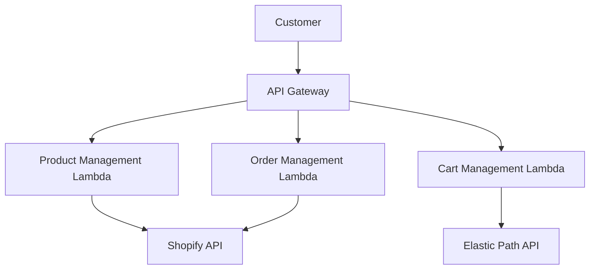
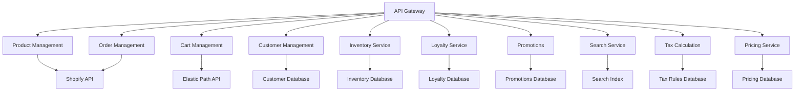
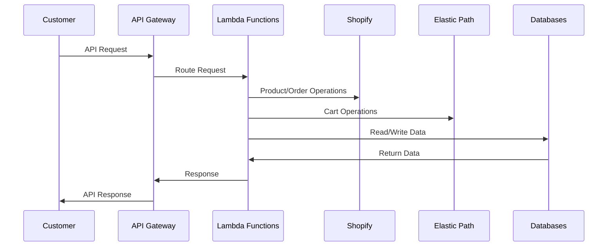
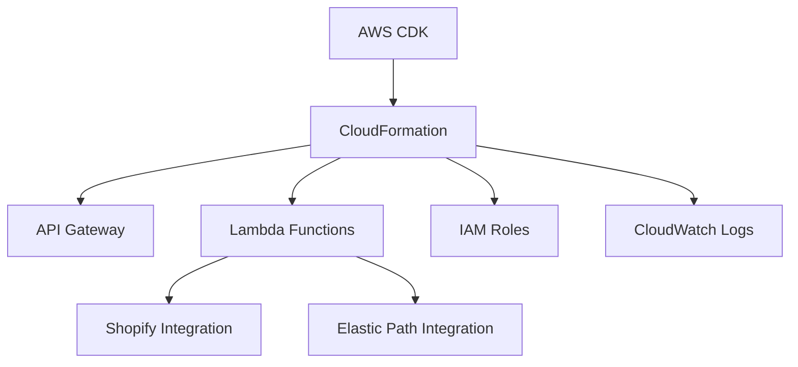

# Shopify-Powered E-commerce Reference Implementation

This repository contains a reference implementation for a serverless e-commerce backend powered by Shopify and integrated with various services. The architecture is designed to be scalable, modular, and easily deployable using AWS CDK.

## Architecture Overview

The system is built using a microservices architecture, with each service responsible for a specific domain of e-commerce functionality. The core of the system is powered by Shopify, with additional services integrated to provide a comprehensive e-commerce solution.

### Key Components

1. **API Gateway**: Serves as the entry point for all API requests, routing them to appropriate Lambda functions.
2. **Lambda Functions**: Handle business logic for different e-commerce capabilities:
   - Product Management
   - Order Management
   - Cart Management
3. **Shopify Integration**: Used for product and order management.
4. **Elastic Path Integration**: Used for cart management.

## Detailed Service Architecture

The system is composed of several microservices, each responsible for a specific domain of e-commerce functionality. Here's a more detailed view of the services and their interactions:

## Service Descriptions

1. **Product Management**: Handles product creation, updates, and retrieval. Integrated with Shopify's product catalog.
2. **Order Management**: Manages order creation, updates, and retrieval. Uses Shopify's order management system.
3. **Cart Management**: Handles shopping cart operations. Integrated with Elastic Path for advanced cart functionality.
4. **Customer Management**: Manages customer profiles and data.
5. **Inventory Service**: Tracks product inventory levels across locations.
6. **Loyalty Service**: Manages customer loyalty programs, points, and rewards.
7. **Promotions**: Handles creation and application of promotional offers and discounts.
8. **Search Service**: Provides product search and discovery functionality.
9. **Tax Calculation**: Calculates taxes for orders based on various rules and jurisdictions.
10. **Pricing Service**: Manages product pricing, including dynamic and personalized pricing.

## Data Flow

## Deployment Architecture

The system is deployed using AWS CDK, which provides infrastructure-as-code capabilities for easy deployment and management.

## Getting Started

To deploy this reference implementation:

1. Clone the repository
2. Install dependencies: `npm install`
3. Configure environment variables (see `.env.example`)
4. Deploy the stack: `cdk deploy`

For detailed setup instructions, refer to the [Setup Guide](./SETUP.md).

## API Documentation

For detailed API documentation, refer to the OpenAPI specifications in the `source/reference-ecommerce/capability/` directory.

## Contributing

We welcome contributions! Please see our [Contributing Guide](./CONTRIBUTING.md) for more details.

## License

This project is licensed under the MIT License - see the [LICENSE](./LICENSE) file for details.