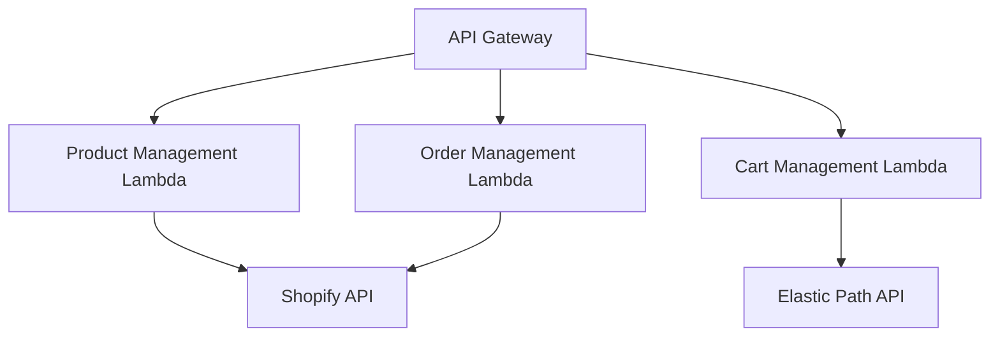

# Shopify-Powered E-commerce Stack

This project implements a serverless e-commerce stack powered by Shopify, using AWS CDK for infrastructure as code. The stack provides a set of microservices that integrate with Shopify's API to manage products, orders, and shopping carts.

## Architecture Overview

The architecture of this stack is based on serverless components in AWS, primarily using API Gateway and Lambda functions. Here's a high-level diagram of the architecture:



### Components

1. **API Gateway**: Serves as the entry point for all API requests.
2. **Lambda Functions**:
   - Product Management: Handles product-related operations.
   - Order Management: Manages order processing and retrieval.
   - Cart Management: Handles shopping cart operations.
3. **External APIs**:
   - Shopify API: Used for product and order management.
   - Elastic Path API: Used for cart management.

## Stack Resources

The `ShopifyPoweredStack` creates the following AWS resources:

- API Gateway
- 3 Lambda functions (Product Management, Order Management, Cart Management)
- IAM roles and policies for Lambda execution

## Getting Started

### Prerequisites

- Node.js (v14.x or later)
- AWS CLI configured with appropriate credentials
- AWS CDK CLI installed (`npm install -g aws-cdk`)

### Installation

1. Clone the repository:
   ```
   git clone <repository-url>
   cd shopify-powered-stack
   ```

2. Install dependencies:
   ```
   npm install
   ```

3. Set up environment variables:
   Create a `.env` file in the root directory with the following variables:
   ```
   SHOPIFY_SHOP_DOMAIN=your-shop.myshopify.com
   SHOPIFY_ACCESS_TOKEN=your-shopify-access-token
   SHOPIFY_API_VERSION=2023-04
   ELASTIC_PATH_API_BASE_URL=https://api.elasticpath.com
   ELASTIC_PATH_CLIENT_ID=your-elastic-path-client-id
   ELASTIC_PATH_CLIENT_SECRET=your-elastic-path-client-secret
   ```

4. Deploy the stack:
   ```
   cdk deploy
   ```

## API Endpoints

The stack exposes the following API endpoints:

- `/product-management/*`: Product management operations
- `/order-management/*`: Order management operations
- `/cart-management/*`: Cart management operations

Refer to the individual Lambda function implementations for specific endpoint details.

## Development

### Project Structure

```
shopify-powered-stack/
├── bin/
│   └── shopify-powered-stack.ts
├── lib/
│   └── shopify-powered-stack.ts
├── test/
│   └── shopify-powered-stack.test.ts
└── integration/
    ├── shopify-product-management/
    ├── shopify_order_management/
    └── elastic-path-cart/
```

### Adding New Features

To add new features or modify existing ones:

1. Update the relevant Lambda function code in the `integration/` directory.
2. Modify the `ShopifyPoweredStack` class in `lib/shopify-powered-stack.ts` if new AWS resources are needed.
3. Update tests in `test/shopify-powered-stack.test.ts`.
4. Run `cdk synth` to verify your changes.
5. Deploy the updated stack with `cdk deploy`.

## Testing

Run the test suite with:

```
npm test
```

This will execute the tests defined in `test/shopify-powered-stack.test.ts`.

## Deployment

To deploy the stack to your AWS account:

1. Ensure your AWS CLI is configured with the correct credentials.
2. Run:
   ```
   cdk deploy
   ```

3. Confirm the deployment when prompted.

After deployment, the API Gateway URL will be displayed in the output.

## Monitoring and Logging

- Use AWS CloudWatch to monitor Lambda function logs and metrics.
- Set up CloudWatch Alarms for important metrics like API latency and error rates.

## Security Considerations

- Ensure that your Shopify and Elastic Path API credentials are stored securely (e.g., using AWS Secrets Manager).
- Regularly rotate API keys and access tokens.
- Implement proper IAM roles and policies to follow the principle of least privilege.

## Contributing

Please read [CONTRIBUTING.md](CONTRIBUTING.md) for details on our code of conduct and the process for submitting pull requests.

## License

This project is licensed under the MIT License - see the [LICENSE.md](LICENSE.md) file for details.