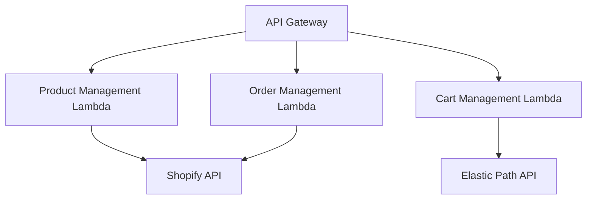

# Shopify Powered E-commerce Stack

This project contains an AWS CDK stack that deploys a serverless e-commerce backend powered by Shopify. It includes API Gateway endpoints and Lambda functions for product management, order management, and cart management capabilities.

## Architecture Overview

The stack consists of the following components:



1. **API Gateway**: Serves as the entry point for all API requests.
2. **Lambda Functions**: Handle business logic for different e-commerce capabilities.
3. **Shopify Integration**: Used for product and order management.
4. **Elastic Path Integration**: Used for cart management.

## Prerequisites

- AWS Account
- AWS CLI configured with appropriate credentials
- Node.js (v14.x or later)
- AWS CDK CLI (v2.x)
- Shopify store and API credentials
- Elastic Path account and API credentials

## Setup

1. Clone this repository:
   ```
   git clone <repository-url>
   cd source/reference-ecommerce/stack/shopify-powered
   ```

2. Install dependencies:
   ```
   npm install
   ```

3. Set up environment variables:
   Create a `.env` file in the project root with the following content:
   ```
   SHOPIFY_SHOP_DOMAIN=your-shop.myshopify.com
   SHOPIFY_ACCESS_TOKEN=your_access_token
   SHOPIFY_API_VERSION=2023-04
   ELASTIC_PATH_API_BASE_URL=https://api.elasticpath.com
   ELASTIC_PATH_CLIENT_ID=your_client_id
   ELASTIC_PATH_CLIENT_SECRET=your_client_secret
   ```

4. Bootstrap your AWS account (if not already done):
   ```
   cdk bootstrap
   ```

5. Synthesize the CloudFormation template:
   ```
   cdk synth
   ```

6. Deploy the stack:
   ```
   cdk deploy
   ```

## Usage

After deployment, you'll receive an API Gateway URL. Use this URL as the base for your API calls.

### API Endpoints

1. Product Management:
   - `GET /product-management/{proxy+}`: Routes to Shopify product management Lambda

2. Order Management:
   - `GET /order-management/{proxy+}`: Routes to Shopify order management Lambda

3. Cart Management:
   - `GET /cart-management/{proxy+}`: Routes to Elastic Path cart management Lambda

For detailed API documentation, refer to the OpenAPI specs in the `source/reference-ecommerce/capability/` directory.

## Development

To add new features or modify existing ones:

1. Update the Lambda function code in the `source/reference-ecommerce/integration/` directory.
2. Modify the `lib/shopify-powered-stack.ts` file to add or change AWS resources.
3. Run `cdk diff` to see the changes that will be applied.
4. Deploy the changes with `cdk deploy`.

## Testing

To run unit tests:

```
npm test
```

## Cleanup

To avoid incurring future charges, delete the stack:

```
cdk destroy
```

## Contributing

Please read CONTRIBUTING.md for details on our code of conduct and the process for submitting pull requests.

## License

This project is licensed under the MIT License - see the LICENSE.md file for details.