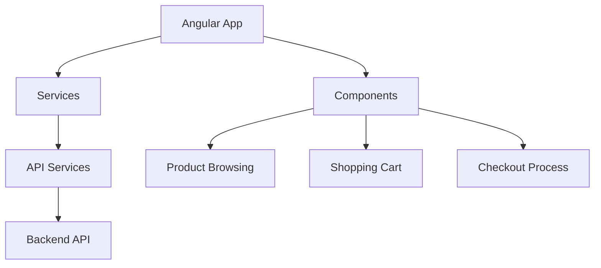

# E-commerce Shopping Application

This is an Angular-based web application for an online shopping platform that allows users to browse products, manage their cart, and complete purchases.

## Getting Started

### Prerequisites

- Node.js (v14 or later)
- npm (v6 or later)
- Angular CLI (v12 or later)

### Installation

1. Clone the repository:
   ```
   git clone <repository-url>
   ```

2. Navigate to the project directory:
   ```
   cd webapp
   ```

3. Install dependencies:
   ```
   npm install
   ```

### Development server

Run `ng serve` for a dev server. Navigate to `http://localhost:4200/`. The app will automatically reload if you change any of the source files.

### Build

Run `ng build` to build the project. The build artifacts will be stored in the `dist/` directory.

## Architecture

The application is built using Angular and follows a component-based architecture. It communicates with backend services through RESTful APIs.



## Features

1. **Product Browsing**: Users can view and search through available products.
2. **Shopping Cart Management**: Users can add, update, and remove items from their shopping cart.
3. **Checkout Process**: Users can enter shipping information, select payment methods, and complete their purchase.

For more detailed information about the features and user stories, please refer to the [application README](.genval/account/reference-ecommerce/application/ecommerce-app/README.md).

## API Services

The application uses various API services defined in the `source/reference-ecommerce/capability/` folder. These include:

- Product Management
- Cart Management
- Order Management
- Customer Management
- Inventory Service
- Pricing Service
- Tax Calculation

For detailed API specifications, please refer to the OpenAPI specs in the respective capability folders.

## Contributing

Please read [CONTRIBUTING.md](CONTRIBUTING.md) for details on our code of conduct and the process for submitting pull requests.

## License

This project is licensed under the MIT License - see the [LICENSE.md](LICENSE.md) file for details.